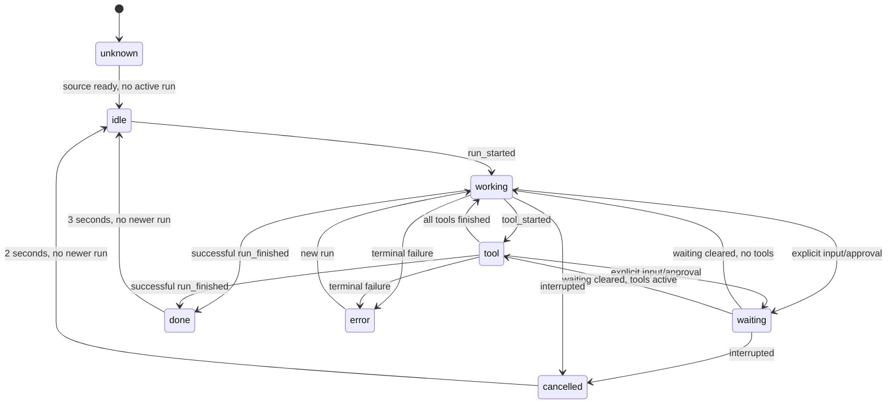
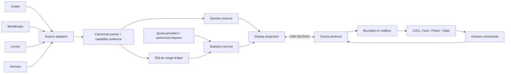

# Bot Status v1 · 完整实施文档（合订版）

**1.75-B 黑色圆屏 / macOS / ESP-IDF v6.1 / Face + Agent Picker + Usage & Quota**

本文件合并人类阅读文档。实际实施请以ZIP中的分文件规范、JSON Schema和测试夹具为准。这里没有已经编译的固件，没有真实账号数据；供应商接入需本机验证。

## 目录

1. [Bot Status v1 · 本地 Agent 实施文档包](#chapter-00)
2. [复制给本地 Agent 的启动提示](#chapter-01)
3. [Bot Status — 本地实施 Agent 必须遵循](#chapter-02)
4. [从已安装的 ESP-IDF v6.1 开始](#chapter-03)
5. [01 · 产品需求规格 PRD](#chapter-04)
6. [02 · 三屏 UI / UX 与动效规范](#chapter-05)
7. [03 · 状态归约、会话、选择与时间](#chapter-06)
8. [04 · 总体架构与模块边界](#chapter-07)
9. [05 · Bot Status Protocol v1](#chapter-08)
10. [06 · ESP32 固件技术设计](#chapter-09)
11. [07 · macOS Bridge、配置与本地服务](#chapter-10)
12. [08 · 四个 Agent 接入总览与能力门禁](#chapter-11)
13. [Codex Adapter](#chapter-12)
14. [Cursor Adapter](#chapter-13)
15. [Tencent WorkBuddy Adapter](#chapter-14)
16. [Nous Research Hermes Agent Adapter](#chapter-15)
17. [09 · 使用量、额度与可信度](#chapter-16)
18. [14 · 实施接口与跨模块边界](#chapter-17)
19. [Bot Status v1 Implementation Plan](#chapter-18)
20. [11 · 测试矩阵、实机验收与发布标准](#chapter-19)
21. [12 · 开发、诊断、恢复与日常运行](#chapter-20)
22. [13 · 安全、隐私与可观测性](#chapter-21)
23. [决策记录与阻塞处理](#chapter-22)
24. [公开资料与证据索引](#chapter-23)
25. [合同目录](#chapter-24)
26. [实施状态 — 待本地 Agent 开始](#chapter-25)
27. [文档包校验报告](#chapter-26)

---

<a id="chapter-00"></a>

原文件：`README.md`

# Bot Status v1 · 本地 Agent 实施文档包

**设备：Waveshare ESP32-S3-Touch-AMOLED-1.75-B（黑色带壳）**  
**开发环境：Apple Silicon macOS · EIM 已安装的 ESP-IDF v6.1 · LVGL 9**  
**文档版本：1.0.0 · 编制/公开资料核查：2026-09-06**

> 本包是实施规格、接口契约、测试样本及交接材料，不是已完成的固件或 Mac 应用。附带的校验工具只验证文档合同与示例；ESP-IDF 编译、板上显示、触摸和四个工具的本机接入，必须由实施者真实验证。

## 一句话目标

在 466×466 圆形 AMOLED 上实现一个有生命感的桌面 Agent 伙伴：**状态驱动的脸、长按选择 Agent、使用量与额度页**。Mac 汇聚 Codex / WorkBuddy / Cursor / Hermes；开发板只做本地动画、展示和低风险交互。

## 固定决策

- 项目独立于 Spring AI Alibaba 企业平台；不做机器人、语音、摄像头、任务执行或自动批准。
- 保留三个逻辑页面：`FACE`、`AGENT_PICKER`、`STATS`；统计内为 `usage/quota` 两个子视图，不增加导航层级。
- 主屏横滑进入统计；统计纵滑切换 usage/quota、右滑返回；长按 650ms 进入 Agent 选择。详见交互规范，禁止各模块自行重新定义。
- 切换 Agent = 切换**观察对象**，不是终止、启动任务，也不是切换账号或模型。
- 固件 C + ESP-IDF **v6.1** + 官方标准 1.75 BSP。不得偷偷降级，也不得刷 1.75C 固件。
- Mac Bridge 使用独立 Python 3.11+ 环境、asyncio、SQLite、pyserial。首版 USB；Wi-Fi 不作为 v1 发布前置条件。
- 状态与统计分通道；保活不重启动画，不重复累计 usage。没有额度来源就显示 `N/A`，不是 0，也不是 100%。
- 四个 Agent 都有页面/适配器/能力报告；实际自动观测覆盖必须单独验收。WorkBuddy 桌面 Hook 能力尚须本机探测，不能拿 CodeBuddy CLI 的文档直接代替。

## 阅读顺序

1. [交给本地 Agent 的启动提示](HANDOFF_PROMPT.md)
2. [项目约束 AGENTS.md](AGENTS.md)
3. [产品需求 PRD](docs/01_PRD.md)
4. [三屏 UX 和视觉规格](docs/02_UI_UX.md)
5. [状态、会话和选择规则](docs/03_STATE_MODEL.md)
6. [架构](docs/04_ARCHITECTURE.md) → [协议](docs/05_PROTOCOL.md)
7. [固件设计](docs/06_FIRMWARE.md) → [Mac Bridge](docs/07_MAC_BRIDGE.md)
8. [四个 Agent 的接入总览](docs/08_ADAPTERS.md) → `docs/adapters/`
9. [统计口径](docs/09_USAGE_QUOTA.md)
10. [按任务实施](docs/10_IMPLEMENTATION_PLAN.md) → [验收](docs/11_TEST_ACCEPTANCE.md)
11. [macOS 首日操作](START_HERE_macOS.md)、[故障与恢复](docs/12_OPERATIONS.md)、[安全](docs/13_SECURITY.md)

[跨模块接口签名](docs/14_INTERFACES.md) · [决策与风险](docs/DECISIONS_AND_RISKS.md)

附带：`contracts/` JSON Schema、协议样例与反例；`design/` 视觉/手势 token；`acceptance/` 状态和手势测试向量；`tools/validate_contracts.py` 文档合同校验。

## 文档优先级

`AGENTS.md` 的安全约束 > `docs/01_PRD.md` 范围 > `docs/05_PROTOCOL.md` + JSON Schema 契约 > 其他技术文档 > 任务步骤。发现冲突先记录并修正文档，不擅自猜测。实际供应商 BSP 是硬件引脚/电源初始化的依据。

旧文件 `Bot_Status_macOS_完整实施方案.md` 中的 v5.5.5、单 Codex、单屏范围被本包替代；不得将旧包混入本项目的最新规范。

## 本地校验文档包

```bash
python3 -m venv .venv-doccheck
.venv-doccheck/bin/python -m pip install 'jsonschema>=4.22,<5'
.venv-doccheck/bin/python tools/validate_contracts.py
```

这个校验不连接开发板、不修改 Agent 配置、不访问账号，也不证明真实设备可运行。

## 第一个实施检查点

完成 T00–T02：只读盘点 → 私有原厂备份 → v6.1 编译官方 LVGL 9 示例 → 人工确认后上板。不得一开始同时接四个 Agent 和统计接口。

## 可发布边界

- `v1-ui-preview`：三屏、手势、模拟数据和异常态完成，但不称真实集成完成。
- `v1-integrated`：四个适配器分别有真实证据或用户明确接受的降级模式；至少在一条真实链路上验证 usage 与 quota。任何缺项都写在 release notes，不能用模拟数据冒充。

外部事实的来源编号统一见 [SOURCES](docs/SOURCES.md)。未有外部来源的阈值、布局、协议字段均为本项目设计决策，不是厂商保证。

---

<a id="chapter-01"></a>

原文件：`HANDOFF_PROMPT.md`

# 复制给本地 Agent 的启动提示

下面整段可直接粘贴。先将本包完整解压到实际工作区，保留目录关系。

```text
请按照当前目录 Bot Status v1 文档包实施，不再重新做产品选型。

先读取 AGENTS.md、README.md、docs/01_PRD.md、docs/02_UI_UX.md、
docs/03_STATE_MODEL.md、docs/05_PROTOCOL.md、docs/10_IMPLEMENTATION_PLAN.md。

目标设备是我已收到的 Waveshare ESP32-S3-Touch-AMOLED-1.75-B 黑色带壳版。
Mac 上已通过 EIM 安装 ESP-IDF v6.1。必须复用该环境，不转 Arduino/PlatformIO，
不擅自降级。第一版只做 Face、Agent Picker、Usage/Quota 三个逻辑页面，
支持 Codex、腾讯 WorkBuddy、Cursor、Nous Research Hermes 的状态与能力分级接入。
不涉及我的 Spring AI Alibaba 企业项目，也不做机器人、语音或自动批准。

你可以开始读文件、检查版本、编写项目代码和运行非破坏性测试。
先列出工作区已有内容，再执行 T00–T02：只读盘点、备份条件、官方示例 v6.1 构建。
首次烧录、原厂固件恢复、修改任一 Agent 的用户配置或安装 launchd 服务前，请单独确认。
不要擦除 Flash、写 eFuse、绕过 Hook 信任或读出我的账号凭证。

按任务顺序增量实现。每任务先测试再实现，完成后提交并更新
reports/implementation-log.md；协议以 contracts/ 与 docs/05_PROTOCOL.md 为准。
三屏 mock 完成后继续真实 Adapter，不能把四张卡片或模拟状态当作四源接入完成。
WorkBuddy Desktop 的真实 Hook 需要能力探测；不能直接套 CodeBuddy CLI。
额度不可得就 N/A，提供范围、来源和更新时间；不伪造剩余额度。

请现在完成环境/仓库盘点并开始首个可执行任务。
第一次回复给出检测结果、实施顺序与需要我确认的硬件操作，不要再泛泛写一份新方案。
```

## 手动阅读的最短路径

先看 `START_HERE_macOS.md`；三屏行为看 `docs/02_UI_UX.md`；完整工作拆分看 `docs/10_IMPLEMENTATION_PLAN.md`。

## 不要这样交付

只把某一段聊天摘要粘给 Agent，容易丢失统计口径、手势冲突处理、B/C 板型限制和恢复流程。应传整个文件夹，至少同时提供 AGENTS、PRD、协议、任务计划和对应 JSON Schema。

---

<a id="chapter-02"></a>

原文件：`AGENTS.md`

# Bot Status — 本地实施 Agent 必须遵循

## 项目与范围

你要实现 ESP32-S3-Touch-AMOLED-1.75-B 的桌面 Bot Status v1。用户已有黑色 B 版，macOS 上已通过 EIM 安装并激活 ESP-IDF v6.1。需求已确认：三屏、状态表情、触摸/滑动、长按 Agent 选择、Codex / WorkBuddy / Cursor / Hermes、usage/quota。

- 不要继续推荐购买硬件。
- 不引入 Spring AI Alibaba、Spring Cloud 或企业 Agent 服务；也不做 robot、音频、摄像头。
- 不迁移到 Arduino / PlatformIO；不擅自降级 ESP-IDF。v6.1 适配问题先定位 BSP/API，再报告最小修复。
- 当前目录已有代码时先读、盘点、运行测试；禁止清空目录后重建、覆盖用户改动或强推分支。

## 必须先读

`README.md`、`docs/01_PRD.md`、`docs/02_UI_UX.md`、`docs/03_STATE_MODEL.md`、`docs/05_PROTOCOL.md`、`docs/10_IMPLEMENTATION_PLAN.md`。

## 硬件安全

1. 先核对芯片、Flash、PCB revision、USB 端口。B 用标准 1.75 工程，不使用 C/1.85 工程。
2. 首次写入前：私有完整原厂备份、长度和 SHA-256、构建日志、待写固件哈希、明确的人工烧录确认。备份不可提交仓库。
3. 本次授权是本地开发，不等于允许任意硬件擦除。禁止自动 `erase-flash`、改 eFuse、启用 Secure Boot/Flash Encryption、改 PMIC rail 或强制解锁读保护。
4. 固件损坏时保持 ROM 下载/恢复路径；不要把日常调试流程写成每次全盘擦除。
5. 不同时启动 monitor / Bridge / esptool 占用同一串口。

## 事实与来源

- 按当前本机版本发现能力，不根据品牌名声推断接口。
- WorkBuddy 是腾讯桌面工作台；CodeBuddy CLI 的 Hook 不能未经实测就标成 WorkBuddy Desktop 支持。
- Hermes 指 Nous Research Hermes Agent；不是用户自建系统。CLI 应选择支持 CLI 的插件/Hook，不照搬 Gateway-only Hook。
- 不读出/显示/上传 API Key、Cookie、完整 Prompt、工具参数、聊天文本和绝对项目路径。用白名单字段、哈希会话 ID、短标签。
- 不调用未证实的私有计费端点，不硬编码套餐额度，不把 token/context/credit/currency 混成一个百分比。
- `exact` 只说明来源测量精度；`coverage` 仍可能为 partial。每个统计字段都保留来源、范围和时间。
- 四张 Agent 卡片 + 模拟动画不等于完成四个真实接入。维护能力报告与发布门禁。

## 行为边界

- 设备切换 Agent 仅改变观察对象。不得停止当前任务、切换账号、创建任务、发送消息或批准工具。
- Hook 必须旁路、快速、失败不改变 Agent 决策；不通过 stdout 注入上下文或 continuation。
- 新增/修改/卸载用户工具的 Hook、插件、launchd 前，输出最小 diff、备份位置和回滚方式并获得确认。
- WorkBuddy MCP 降级只能标记 `reported`，人工状态只能 `manual`。它们不是完整生命周期观测。
- BLE/Wi-Fi、SwiftUI/Tauri、通知中心、语音、自动前台应用追随均非 v1 必需，不抢先实现。

## 开发规约

- 用官方 BSP 初始化 CO5300/CST9217/PMIC，不猜 GPIO。锁定 vendor commit、BSP、LVGL 和 `dependencies.lock`。
- 所有 LVGL 对象更新在唯一 UI 所有者上下文中；接收线程只校验/入队；禁止网络回调里直接操作 LVGL。
- 所有队列、字符串、缓存、重试都有上限；运行态只存 RAM。
- 先写可失败的测试/夹具，再最小实现；每任务一条可回退提交。
- 所有测试向量使用固定时钟/随机种子；不要靠等待现实时间验证超时。
- 保活不重启眨眼/完成动画；乱序旧事件不回滚新 run；同一 usage 不重复入账。
- 累计 token 是快照，不是增量；缺失值不能用 0 代填。
- 暗屏第一次触摸只唤醒，抬手前不得继续触发单击/长按。
- UI 色彩：状态色固定含义，Agent 主题色只用于标识，不能把成功/错误颜色改成品牌色。

## 交付与报告

每任务结束更新 `reports/implementation-log.md`（实施时创建）：变更文件、执行命令、测试结果、硬件是否实际验证、剩余风险、下个任务。

只允许以下实证描述：`文档校验通过`、`主机测试通过`、`ESP-IDF 编译通过`、`已烧录`、`实机验收通过`。不可互相替代。

无设备访问时完成 host/UI simulator 工作并标 `BLOCKED_HARDWARE`。来源不可用时标 `BLOCKED_SOURCE` 并说明具体证据，不伪造数据，不把整个项目停在讨论中。

---

<a id="chapter-03"></a>

原文件：`START_HERE_macOS.md`

# 从已安装的 ESP-IDF v6.1 开始

用户已经通过EIM安装并激活v6.1，不再安排重复安装。先完成官方示例与安全备份；本页不启动四源集成。

## 1. 验证当前shell

```bash
idf.py --version
printf '%s\n' "$IDF_PATH"
python -c 'import sys; print(sys.executable)'
```

预期版本v6.1，IDF路径通常为 `$HOME/.espressif/v6.1/esp-idf`。在EIM“打开终端”生成的shell使用即可。其他终端需要激活时，先确认脚本存在：

```bash
test -f "$HOME/.espressif/tools/activate_idf_v6.1.sh" &&   . "$HOME/.espressif/tools/activate_idf_v6.1.sh"
```

脚本不存在就回EIM打开，不拼接其他版本路径。固件用EIM自己的Python；Bridge用另外的venv，不往EIM环境塞应用依赖。

## 2. 工作区

推荐真实代码在 `$HOME/Workspace/bot-status`。先检查该目录是否存在/是否有Git变更；本包可放其根目录或 `handoff/`。已有项目不能覆盖。

```bash
mkdir -p "$HOME/Workspace/bot-status/vendor"
cd "$HOME/Workspace/bot-status/vendor"
# 仅当 waveshare-1.75 目录不存在时执行clone
git clone https://github.com/waveshareteam/ESP32-S3-Touch-AMOLED-1.75.git waveshare-1.75
cd waveshare-1.75
git rev-parse HEAD
```

使用标准1.75仓库，B版不是C版。[S01][S02]

## 3. 编译（此步不写开发板）

```bash
cd "$HOME/Workspace/bot-status/vendor/waveshare-1.75/examples/esp-idf/02_lvgl_demo_v9" &&   idf.py -B build-idf61 set-target esp32s3 &&   idf.py -B build-idf61 build
```

第一次会解析BSP/LVGL组件；保存dependencies.lock。官方指南目前明确验证5.5.5/6.0.2，用户目标6.1应先本机编译验证，不未经同意换版本。[S02][S03][S04]

构建失败记录第一条真实编译/API错误及上下文；不要只发最后的build failed。不用全盘升级依赖“碰运气”。

## 4. 接板与只读备份

使用可传数据USB-C线直连Mac。列出端口并通过拔插确认：

```bash
ls /dev/cu.*
python -m esptool version
```

在已有EIM工具中使用对应esptool；下面是v5连字符语法，先确认help支持。若版本不同，在独立tools venV装 `esptool>=5,<6`，不要升级EIM内部工具。

```bash
export PORT='/dev/cu.usbmodem1101' # 改为真实确认的端口
python -m esptool --chip esp32s3 --port "$PORT" flash-id
```

核对ESP32-S3与16MB。不同容量/不同板型先停止，不能按标题强刷。

```bash
export BACKUP_DIR="$HOME/Workspace/bot-status-private-backups/$(date +%Y%m%d-%H%M%S)"
umask 077
mkdir -p "$BACKUP_DIR"
python -m esptool --chip esp32s3 --port "$PORT" --baud 460800   read-flash 0 ALL "$BACKUP_DIR/factory-full.bin"
stat -f '%z bytes' "$BACKUP_DIR/factory-full.bin"
shasum -a 256 "$BACKUP_DIR/factory-full.bin" > "$BACKUP_DIR/factory-full.bin.sha256"
```

16MiB应为16777216字节。备份可能含配网数据，不提交仓库。[S15] 记录大小+hash仅证明备份文件记录，不等于恢复测试已通过。

## 5. 人工确认后烧录官方示例

关闭Bridge与monitor，核对固件、端口、备份与schema，再执行：

```bash
cd "$HOME/Workspace/bot-status/vendor/waveshare-1.75/examples/esp-idf/02_lvgl_demo_v9"
idf.py -B build-idf61 -p "$PORT" flash monitor
```

`Ctrl+]`退出monitor。不先erase整片、不将1.75C/bin或其他build的partition混在一起。[S02]

验收：自己编译的画面显示、触摸读数正确、15分钟无Panic/白屏/反复复位。之后才复制为firmware工程开发Face。

## 6. 卡住时

下载失败：先排线/端口占用，再按板子官方BOOT/复位说明进入下载模式；PWR不是可随意当RESET使用的按钮。不要拆壳短接引脚。无串口先看USB数据线，标准板原生USB无需默认装CH340驱动。[S01][S05]

白屏：先恢复同一构建的官方示例，检查电源初始化、panel初始化、flush回调和依赖锁，不猜PMIC寄存器。触摸反向只在board_port修正一次。

## 下一步

按 `docs/10_IMPLEMENTATION_PLAN.md` 执行T03起的合同/状态/交互任务。本页命令是开发环境操作；完整Bridge命令在实现之前并不存在，不应照着执行后误以为安装失败。

---

<a id="chapter-04"></a>

原文件：`docs/01_PRD.md`

# 01 · 产品需求规格 PRD

**产品：Bot Status v1 / Agent Puck。规范级别：实施基线。**

## 1. 用户、场景、目标

用户是以 macOS 为主的开发者，设备已到手。设备用于办公室/家中的桌面余光提示，不是新聊天入口。第一版连接一台 Mac、一个圆屏设备，固定展示四个 Agent 产品，并允许一个产品有多个本地会话。

首批身份固定：OpenAI Codex、Tencent WorkBuddy、Cursor Agent、Nous Research Hermes Agent。来源应由适配器区分；例如 Cursor 中运行的 Codex 扩展不能再计为 Cursor 原生 Agent。

**核心体验**：平时是一张自然眨眼的脸；工作时变得专注；等待输入时主动看向用户；完成时给短暂微笑。点一下有回应，横滑看统计，按住切换观察对象。

## 2. 必需范围与需求编号

| 编号 | 必须实现 | 验收重点 |
|---|---|---|
| R01 | 1.75-B + ESP-IDF v6.1 构建基线 | 官方示例编译及实机显示，保留备份 |
| R02 | Face 本地程序化表情 | idle/working/tool/waiting/done/error/cancelled/unknown 可辨 |
| R03 | 触摸、横纵滑动、长按 | 每触摸序列最多一个手势，不冲突 |
| R04 | 长按 Agent Picker，四个卡片 | Codex/WorkBuddy/Cursor/Hermes；离线也可查看 |
| R05 | 选择双向确认 | Host authoritative、请求幂等、断线不假成功 |
| R06 | Stats：usage/quota | 缺失/估计/人工/过期/部分覆盖明确可见 |
| R07 | USB 双向通信 | 可重连、日志分流、异常包不崩溃 |
| R08 | 四源 Adapter 与能力报告 | 每源独立真实验收或明确降级接受 |
| R09 | 统计账本与去重 | 事件重复、快照重复、历史重放不重复计费 |
| R10 | 非当前 Agent 提醒 | 小通知/徽标，不劫持当前页面和选择 |
| R11 | AMOLED 保护与断连 | 降亮、移位、关屏、唤醒吞手势 |
| R12 | 只读与隐私 | 不批准工具、不读取/外发凭证、不存聊天内容 |
| R13 | 可复现交付 | lock、构建记录、测试夹具、恢复步骤、发布说明 |

## 3. 三屏的唯一正式定义

- `FACE`：默认主屏。脸 + 顶部 Agent + 底部短状态 + 固定语义外环。短详情是 overlay，不是第四屏。
- `AGENT_PICKER`：模态选择屏。进入时保存返回页，滑动只预览，点击中央卡片才发出选择请求。
- `STATS`：一个逻辑屏，`usage/quota` 两个子视图。纵滑切子视图、右滑回 Face。绝不自动轮播让人来不及读。

`done` 等是业务状态；`FACE/STATS` 是导航状态；`online/stale/offline` 是连接状态。三者分开存储，不能用 `state="stats"` 覆盖正在运行的 Agent。

## 4. 典型旅程

### 首次开机

在没有 Bridge 时显示离线表情和短提示 `CONNECT MAC`，仍能进入四源选择和缓存统计；缓存为空显示 `N/A`。不自动播放假工作状态。Demo 是显式启动模式，所有页面固定带 `SIM`。

### 日常工作

Bridge 选中 Codex。用户提交任务后表情变化；工具执行时显示 `TOOL` 及白名单工具标签。进入统计页不会暂停后台状态更新，右滑回脸时立即呈现最新状态。

### 切换 Agent

长按 650ms → carousel → 左右滑动预览 → 轻触中央卡片 → 显示短暂 pending → 收到 Host ack 与相同 revision 的 focus → 返回该 Agent 的 Face。选择不会打断任何任务。

### 同时运行多个会话

选择的是产品级 Agent。Bridge 从该产品的会话中选代表会话，优先待处理输入，其次运行中；显示 `2 ACTIVE` 等短计数。v1 不提供层层深入的会话列表，Mac CLI 可固定某会话。

### 查额度

主屏横滑 → Usage → 上滑 Quota。支持两条独立额度窗口/积分池；每条显式单位、剩余或已用、重置时间和新鲜度。无法读取时显示 `N/A` 并在详情解释 `NO API` / `SIGN IN` / `MANUAL`。

## 5. “实用且炫酷”的可验收定义

- 60cm 桌面视距无需读小字，也能分辨工作、等待、错误。
- 选中 Agent 由名字/单独小标识表达；错误仍是红色，等待仍是琥珀色，不用品牌色覆盖状态。
- 三种生命感：眨眼有轻微随机性、触碰时眼睛短暂看向触点、状态过渡有形变而非硬切。
- 酷来自细腻节奏，不来自大范围白闪、持续 3D 粒子或密集霓虹文本。
- 没有真实百分比的工作环是活动指示，不放数字、不假装进度。
- 8 小时使用无异常重启；用户退出 Bridge 后 Agent 本身继续正常工作。

## 6. 不在 v1

机器人/摄像头/麦克风/语音、聊天历史、代码预览、工具审批、切换模型/账号、自动执行任务、任意资源上传、云端服务、团队多用户、BLE、OTA、完整 Mac GUI、运行时全屏逐帧推图。

Wi-Fi WebSocket 作为 v1.1；保留传输接口但不要求双栈同时交付。菜单栏或打开原应用是后续便利性，不得阻塞核心三屏。

## 7. 交付与验收口径

三屏 UI 和四源适配器在 v1 范围内。外部产品缺少可靠观察接口属于**接入风险**，不是允许虚构状态的理由。

每个源的 release matrix 必须列：安装版本、使用入口、状态能力、usage 来源、quota 来源、降级标签、最后实测日期。WorkBuddy 无法获得实时 Hook 时，可实现 MCP 自报或人工输入通道，但必须经用户明确接受才能把该源以降级模式纳入发布；不得静默把原需求删掉。

## 8. 补充但不增加核心屏的功能

优先实现：`attention badge`（其他 Agent 等待提示）、`tap reaction`（戳脸反馈）、`privacy mode`（隐藏 detail）、`data age`（统计更新时间）、`quiet/dim`（不打扰）。不增加宠物养成、小游戏、成就系统或自动播放长动画。

---

<a id="chapter-05"></a>

原文件：`docs/02_UI_UX.md`

# 02 · 三屏 UI / UX 与动效规范

## 1. 画布与风格

画布固定 **466×466**，中心 `(233,233)`。整个背景为 `#000000`。圆屏有效可视区域内做布局，不把文字放进方形画布角落。一般内容安全半径 210px，触摸命中测试须同时满足屏幕圆形区域。

默认设备文案用短英文与 Agent 原名，避免依赖任意中文字体；Mac 配置/报告用中文。动态 detail 由 Host 清洗为短 ASCII 标签，首版不发送项目原名、中文长任务或聊天内容。后续中文化单独制作授权字体子集，不能把无法显示的字变成方块。

### 颜色分工

| 用途 | 色值 | 规则 |
|---|---|---|
| 眼睛 | `#DDEAF2` | 降亮白，不常驻纯白 |
| 次级文本 | `#83949F` | 仅辅助信息，不承担唯一告警 |
| 工作 | `#5A9BFF` | 专注眼 + 低速弧线 |
| 工具 | `#AE8CFF` | 短节律脉冲 |
| 等待 | `#FFBE55` | 问号 + 固定琥珀标记 |
| 完成 | `#6DE1A3` | 一次扩散，不持续闪 |
| 错误 | `#FF707C` | 两次低幅脉冲后常驻标记 |
| 离线/未知 | `#647680` | 虚线/问号，不冒充 idle |

Agent 色只用于顶部 8px 小点和 Picker 标识。Codex 青、WorkBuddy 绿、Cursor 淡紫、Hermes 橙是本项目主题，不声称是品牌官方色。状态含义始终优先于主题色。

### 字号与排版

顶部 Agent 24px；状态 24px；统计主数字 54–64px；指标行 24px；说明/新鲜度 20px。默认使用 BSP/LVGL 可获得的 Montserrat 字体；需覆盖的字符包括 ASCII、百分号、斜线、减号。字体资源和许可不随本包分发，由实施者使用开源字体并保留许可。

## 2. Face 布局

| 元素 | 几何/位置 | 内容 |
|---|---|---|
| Agent 标题 | x=113,y=57,w=240,h=32 | Codex / WorkBuddy / Cursor / Hermes |
| 标识点 | cx=101,cy=73,r=4 | Agent 主题色 |
| 外环 | center=(233,233),r=199,stroke=3 | 状态语义，不包裹长文本 |
| 左眼 | center=(178,225),w=66,h=92 | 圆角动态形变 |
| 右眼 | center=(288,225),w=66,h=92 | 与左眼独立但协调 |
| 下方状态 | x=91,y=322,w=284,h=32 | WORKING / WAITING 等 |
| 辅助标签 | x=109,y=358,w=248,h=24 | TOOL / Terminal / 01:24 / 2 ACTIVE |
| 短提示 | x=153,y=409,w=160,h=24 | HOLD TO SWITCH；首次使用才常显 |

状态详情 overlay 居中 w=300,h=118，显示源、短工具标签、运行时长、证据质量；2秒消失，遇触摸立即取消。不要遮蔽 waiting/error 标记。

### 表情参数初值

| 状态 | 眼型/视线 | 动作与节奏 |
|---|---|---|
| idle | 中性圆角竖眼 | 2.8–6.5秒随机眨眼；每3–6秒视线位移不超过±9px |
| working | 高度略收、间距稳定 | 2.4秒环弧循环；不是任务百分比 |
| tool | 专注窄眼 | 工具变化时180ms压缩/回弹；持续状态不反复重播 |
| waiting | 直视、略睁大 | 2.2秒低幅亮度呼吸；静止问号辅助 |
| done | 弯眼微笑 | 700ms一次完成动作，保持总共3秒，随后idle |
| error | 收眼/叉眼 | 2次温和脉冲总时长600ms，之后稳定错误态 |
| cancelled | 放松、半闭眼 | 500ms退出动作；2秒后idle，无红色失败 |
| unknown | 中性偏闭眼 | 显示问号与来源缺失；不做工作动画 |
| link offline | 休息眼 | `MAC OFFLINE`；与 Agent 未运行分开 |

触摸戳脸：视线向触点偏移最多10px，约350ms回正；节流600ms。working只轻微回应，waiting/error不转成笑脸，以免反馈覆盖告警。

## 3. Agent Picker 布局

进入时保存 return route，预览项从当前已选 Agent 开始。候选顺序固定：Codex → WorkBuddy → Cursor → Hermes，允许首尾环绕。

- 标题 `(123,58,220,32)`：`SELECT AGENT`。
- 中央圆形卡片 `(161,154,144,144)`，预览 Agent 用抽象图形/首字母，不下载不明商标素材。
- 名字 y=314，状态 y=348；左右各露出约36px的弱化相邻卡片。
- 中央命中区 `(145,139,176,176)`，最小目标56px。左右只是预览，不因滑过而写入选择。
- 底部显示 `TAP TO SELECT` / `SELECTING...` / `MAC OFFLINE`。

动画：carousel平移180ms，缩放0.82→1.0；使用对象平移/透明度，不做真正3D透视。

确认：发请求后最多等待2秒，最多一次同 action_id 重试；总4秒失败。**只有 ack=accepted 且收到同 revision 的 focus，才返回新的 Face。**期间保持原 selected 不变；正在浏览的preview单独存储。

离线允许浏览卡片，但确认按钮禁用，提示 `CONNECT MAC`。15秒无交互自动取消，不更改选择。取消回到进入前页面，成功选择一律回新 Agent 的 Face。

## 4. Stats 布局

统计是一屏，内部 `usage` / `quota` 两子视图，顶部相同 Agent 标签，右上小字标 `USAGE` 或 `QUOTA`。不同时塞入两套完整表格。

### Usage

- 主数字 y=133,h=74：默认今日 `TURNS`，不是模糊 `REQ`；有可靠 token 时用户可在Mac配置主指标为总token。
- 第二/三行 y=251/293：`TOKENS` 与 `ACTIVE`，每行一个值。
- 微型24桶 sparkline位于 `(105,332,256,30)`，只画真实有覆盖数据；缺段留空，不能插值制造连续活动。
- 底部新鲜度 `(130,375,206,22)`：`LOCAL / 2s` / `PARTIAL` / `~ ESTIMATED`。
- 本地日界线/范围在详情中说明。统计只反映当前Agent，不是四者总和。

### Quota

最多两条额度卡，支持滚动窗口、积分、货币预算。布局中上/中下两条，每条名称、主数字、细条/弧、重置时间。

示例仅为设计数据：

```text
Codex                  QUOTA
SHORT WINDOW       73% LEFT
[=======---]       RESET 2h
LONG WINDOW        41% LEFT
[====------]        RESET 2d
OFFICIAL / 1m          REFRESH
```

不要硬编码窗口是5小时/一周；由源返回的名称/窗口长度生成标签。余额只有 remaining、没有 limit 时，显示余额数字，不画“剩余百分比”。

缺失显示 `N/A`；无限显示 `UNLIMITED`；过期显示旧值加 `STALE`；手工值显示 `MANUAL`；本地预算显示 `LOCAL BUDGET`，不得称套餐余额。

刷新命中区 `(150,372,166,48)`；重复点击只显示缓存与倒计时，不突破源接口限流。详情overlay可解释来源、范围、更新时间和缺失原因；长内容由Mac日志/CLI查看。

## 5. 唯一手势表

| 手势 | FACE | AGENT_PICKER | STATS |
|---|---|---|---|
| 轻触中央 | 视线回应 + 2秒短详情 | 确认预览项 | 显示指标详情 |
| 左滑 | 进入Stats上次子页，首次Usage | 下一个Agent | 不切页，仅轻微边界反馈 |
| 右滑 | 进入Stats上次子页 | 上一个Agent | 返回Face |
| 上/下滑 | 无导航动作 | 下滑取消；上滑无动作 | usage / quota切换 |
| 长按650ms | 进入Picker | 取消并回进入前页面 | 进入Picker |
| 点击Refresh | 无 | 无 | 仅刷新按钮区域有效 |

全局暗屏后第一次按下只唤醒；等完全抬手后，下一次触摸才产生业务手势。

### 仲裁参数

- tap：按下到抬起≤250ms，最大位移≤12px。
- long press：650ms，整个过程位移≤12px；120ms后开始hold环；滑动超限立刻取消。
- swipe：位移≥56px、时长120–700ms、主轴位移≥另一轴的1.4倍。
- 介于250–650ms的静止按压不算tap，也不算long；不做双击识别。
- long一旦触发，该触摸序列余下事件全部consume，不能抬手又触发tap。
- 圆屏无效边界触点、多指、不合理跳点直接取消序列。

所有时间来自单调时钟。触摸旋转在输入适配层处理一次，UI固定屏幕坐标；v1关闭随IMU自动旋转，避免滑动方向突然改变。

## 6. 通知和数据状态

非当前Agent变为waiting/error：顶部小toast 2秒，角落徽标持续到该事件解除；不自动换Agent，不遮住Picker手势。所有通知按 `(agent,run,kind)` 去重，2秒合并，一次最多3条，更多显示计数。

同一waiting不随每次心跳重新弹出。done只短暂提示，不把后台完成事件抢成当前脸。

## 7. 亮度/动画模式

默认亮度28%，dim 8%。3分钟用户未操作且没有新业务事件时，idle进入dim；working可降到18%，waiting/error保持28%但不闪烁轰炸。纯heartbeat不重置活跃计时。

Bridge失联6秒显示离线，30秒关屏；2分钟以后仍持续接收通信。重新连上以短淡入唤醒，屏幕关闭不进入MCU deep sleep。

每5分钟全UI偏移1–2px，变更以当前内容边界为约束；这是缓解策略而不是不会烧屏的承诺。等待状态长时间常驻也要微移。选项 `reduced_motion` 关闭呼吸与粒子，仅保留必要切换。

## 8. UI验收证据

必须在真圆屏上记录Face七类状态、Picker四卡片、Usage/Quota缺失与过期态、长按/滑动/唤醒的视频。桌面模拟器截图通过不代替触摸实机测试。设计token见 `design/ui_tokens.json`；文档中的初始值可因实机可读性微调，但不得改变交互语义。

---

<a id="chapter-06"></a>

原文件：`docs/03_STATE_MODEL.md`

# 03 · 状态归约、会话、选择与时间

## 1. 四个正交维度

```text
business_state : idle | working | tool | waiting | done | error | cancelled | unknown
source_health  : ready | partial | unavailable | needs_auth | disabled
link_state     : handshaking | online | offline
ui_route       : FACE | AGENT_PICKER | STATS
```

`stats`、`switching` 不属于业务状态。设备断开时保留最后业务快照但画离线态，不在Bridge账本中伪造一次Agent错误。

状态证据质量：`observed`（生命周期/结构化事实）、`inferred`（不完整结构推断）、`reported`（Agent通过MCP自报）、`manual`、`simulated`。`unknown`不是错误，`cancelled`不是失败。

## 2. CanonicalEvent（仅在 Mac 内部）

Schema：`contracts/agent-event.schema.json`。关键字段：

```text
agent_id, source_instance, event_id, session_key, run_id,
kind, occurred_at_ms, received_at_ms, source_seq, quality,
tool_call_id, usage_record, reason, detail
```

- `session_key` 是本地哈希，不发绝对工作区路径。
- run是一次用户轮次/任务生命周期，不是每次LLM API调用。
- tool_call_id用于集合增删；并发工具返回一个不代表其他工具已结束。
- 事件来源的原始格式不进入设备协议。取白名单后立即丢弃Prompt/工具参数。
- event_id使用上游稳定ID；缺失时由源实例、session、run、kind、工具ID、源内序号构成稳定摘要。不能用每次重试新UUID导致重复计数。

## 3. 单run归约规则

| 事件kind | 处理 |
|---|---|
| session_opened | 建会话，尚无活跃run则idle；不增加任务数 |
| run_started | 创建run，turn计数一次；清空新run自己的工具集合；working |
| tool_started | 向集合加入tool_call_id；非waiting时tool |
| tool_finished | 移除匹配tool；仍有工具则tool，否则working |
| tool_failed | 记录工具失败并移除；仅终止性run失败才进入error |
| waiting_started | 保存waiting_reason=input/approval；waiting |
| waiting_cleared | 恢复tool或working；没有开始事实则unknown |
| run_finished | 同run终结：done（completed）/cancelled/error |
| session_closed | 若有活跃run但无结局，不假称done，标unknown/stale |
| usage_recorded | 只更新账本，不因计费信息改变表情 |
| source_status | 更新source_health，不直接创造run |

等待若只来自“工具开始”不能认定；必须有明确权限/输入等待事件。模型API失败但自动重试中也不能提前宣告整个run失败。

`done`表情保持3秒后呈现idle，`cancelled`保持2秒。终结事实保留在Mac；设备只停止庆祝动画。新run/新waiting立即覆盖旧done，旧run迟到的stop不得覆盖新run。

## 4. 多会话与代表会话

v1显示一个产品的代表会话，但Bridge管理每产品最多16个活动会话、总64个；超过上限不任意逐出正在waiting的会话，拒绝新增并给出capacity告警。

选择规则：

1. 若Mac配置固定session，且该session可观察，固定它。
2. 否则优先waiting会话（最早未解决者优先）。
3. 否则保留当前仍在working/tool的代表会话，防止频繁跳脸。
4. 当前无活动时，选最近开始的working/tool。
5. 再选最近3秒内done或持续未确认error。
6. 最后显示idle；没有可靠观测则unknown。

`active_sessions`显示该产品工作/工具/等待的会话数。切换产品不清空任何会话。来自其他产品的提醒只加badge/toast。

产品色与状态色正交；一个产品背后可用不同模型/provider。Hermes通过Codex后端执行时，用 `origin_agent_id=hermes` 归属该任务，底层Codex仅作 provider；没有可关联ID时不能跨源合并，显示可能重复的覆盖说明，不制造全局总数。

## 5. 连接、新鲜度与恢复

- USB保活：Bridge每2秒发ping；设备回pong。6秒没有合法消息视为link offline；30秒关屏。
- 源的状态新鲜度与USB独立。Bridge在线但某Agent无法观察时，health=partial/unavailable。
- Hooks是事件流，可能长时间安静。无业务事件300秒时标 `stale=true`，但不自动判为完成/离线；若有可靠run查询或进程/会话存活证据，可更新该源的观测时间。
- 查到进程存在只能证明进程存在，不能证明在工作。
- Bridge重启：历史usage可恢复，活跃run先标unknown并重新获取证据；不得将落盘working直接当现在还在工作。
- 时间差/TTL/手势用单调时钟；日统计和reset时间用UTC毫秒 + IANA时区。Mac睡眠唤醒后作一次显式resync，不能补播过期done动画。

## 6. 并发、乱序、重复

对同source_instance/session/run维护 `source_seq`（若上游有）。重复event_id忽略；未知seq的迟到事件只能在所属run范围内补事实，不能回滚已终结run或当前新run。

工具集合上限32/run；超限标partial并截断UI明细，不影响Agent任务。事件队列满时不丢账本终结事实：Hook落私有有界spool，Bridge优先处理终结/等待事件；容量耗尽后显式记录lost_events，统计coverage=partial。

UI快照可合并为最新值；控制ack与通知不允许被普通heartbeat淹没。总线只保证当前显示最终一致，不承诺展现每个持续10ms的工具步骤。

## 7. 选择事务

Host保存 `selected_agent` 和递增 `selection_rev`。设备有独立 `preview_agent`。请求携带 `action_id`、目标agent、`base_selection_rev`。

- accepted：Bridge先持久化选择（SQLite事务），rev+1，返回ack，再发新focus与stats。
- conflict：base_rev旧，返回rejected和当前selected/rev，设备恢复权威值。
- replay：同link/action_id返回相同ack，不二次递增rev。
- timeout：4秒未完成则取消pending；不要把本地预览当已成功。
- 断线期间不缓存选择请求用于自动重放，避免连上另一台Mac后意外切换。

设备重新连接接收Host选择；未握手前最多显示上次缓存，带offline。选择偏好只在Host持久化，不频繁写板上NVS。

## 8. 状态机图



完整边界见 `acceptance/state_cases.json` 和验收文档。状态图是视图，不代替run_id约束。

## 9. 状态源字段补充

CanonicalEvent 的 `source_health` 只在 `kind=source_status` 时非null，取ready/partial/unavailable/needs_auth/disabled。其他事件必须null，防止一次usage事件误改连接。空source/run/tool标识不能当作合法ID。Host将health投影到catalog，设备不自行猜测进程状态。

---

<a id="chapter-07"></a>

原文件：`docs/04_ARCHITECTURE.md`

# 04 · 总体架构与模块边界

## 1. 选定路线

**ESP-IDF v6.1 + C + Waveshare BSP + LVGL 9；Mac Python Bridge；USB优先。**

不选 ESP32 直连四家云API：账号/产品差异不应进入固件。也不选视频推屏：网络波动不该让眨眼停顿。初版不写SwiftUI/Tauri壳：本地CLI、诊断和launchd足够，后续可复用Bridge服务。

## 2. 流向



## 3. 固件边界

| 模块 | 只做什么 | 不做什么 |
|---|---|---|
| board_port | BSP包装、触摸坐标、电源/亮度 | 不自改PMIC引脚和rail |
| protocol | 帧拆分、版本/范围/seq校验 | 不更新LVGL，不解释产品原始Hook |
| device_store | catalog/focus/stats缓存、选择revision | 不计算真实计费 |
| face | 参数化眼睛、眨眼、状态过渡 | 不读取网络或Flash账号 |
| navigation | 三屏路由、modal返回、手势仲裁 | 不执行任务 |
| stats_view | 显示与格式化 | 不根据计时猜剩余额度 |
| power | 亮度、dim、display off | v1不让MCU deep sleep |

## 4. Bridge边界

`adapter`输出CanonicalEvent或CapabilityReport；`reducer`独立纯逻辑；`ledger`幂等计数；`quota_provider`定时/手动刷新；`projection`生成设备所需短信息；`transport`只管串口；`commands`只允许选择/刷新/已配置应用打开。

Source Adapter不能直接设置脸型，UI也不能知道腾讯/Nous的日志结构。厂商变化应局限在 `bridge/src/bot_bridge/adapters/`。

## 5. 并发模型

Mac asyncio一条主loop，serial读写置独立worker或非阻塞封装；SQLite写入串行worker，不在串口接收回调执行长事务。Hook先做白名单清洗，写本地有界spool或快速HTTP，超时不得挂住原Agent。

ESP32沿用BSP的LVGL调度/显示锁；RX/TX两个轻任务，渲染只有一个逻辑owner。UI每33ms检查最新mailbox（目标30fps）；不复制整个动态对象树。Stats页不可见时只更新缓存，不每条usage都绘图。

## 6. 建议源码布局（实施时创建）

```text
firmware/
  CMakeLists.txt
  sdkconfig.defaults
  partitions.csv
  main/app_main.c
  main/idf_component.yml
  components/board_port/{board_port.c,include/board_port.h}
  components/bot_core/{frame_parser.c,decode.c,device_model.c,gesture.c,router.c,format.c,power_policy.c}
  components/bot_core/include/{bot_types.h,bot_gesture.h,bot_frame_parser.h,bot_model.h}
  components/bot_ui/{face.c,face_anim.c,picker.c,stats.c,notice.c,ui.c,include/bot_ui.h}
  components/bot_transport/{usb_serial.c,include/bot_transport.h}
bridge/
  pyproject.toml
  src/bot_bridge/{cli.py,config.py,service.py,capabilities.py,models.py}
  src/bot_bridge/{reducer.py,ledger.py,storage.py,selection.py,actions.py}
  src/bot_bridge/{usage.py,quota.py,imports.py,protocol.py,serial_link.py,publisher.py}
  src/bot_bridge/{server.py,auth.py,spool.py,hook_emitter.py,simulate.py}
  src/bot_bridge/adapters/{base.py,codex.py,cursor.py,workbuddy.py,hermes.py}
  src/bot_bridge/installers/{codex_hooks.py,cursor_hooks.py,launchd.py}
  migrations/001.sql
  tests/
integrations/{hermes_bot_status,workbuddy_status_mcp}/
tests/native/          纯C逻辑测试，不链接板上驱动
simulator/             原生LVGL SDL测试入口，不是Web仿真替代品
evidence/              本地真实检测、硬件测试与发布报告
```

相邻文件共同变化时可以合并；不要把一个20行文件强行拆五层框架。纯逻辑头文件不要依赖ESP-IDF/LVGL，以便Mac原生C测试。

## 7. 版本和依赖

EIM用户已安装的v6.1是目标；不重新装“默认最新版”。官方当前示例指南列出的验证线是v5.5.5/v6.0.2，因此T02必须先执行v6.1兼容性验收。[S02][S04]

当前示例 `02_lvgl_demo_v9/main/idf_component.yml` 指向LVGL `9.4.*` 与标准1.75 BSP通配版本。以本地首次成功解析为准，提交lock并将通配符改为已验证版本，不手写猜测版本号。[S03]

## 8. 关键设计决策

| 决策 | 理由 | 放弃的替代 |
|---|---|---|
| 三个逻辑页面 | 控制圆屏认知负担 | 五层设置/任务列表 |
| Host权威选择 | 多来源/断连一致 | 设备先乐观切换永不回滚 |
| 分离统计与focus | 避免每2秒重传所有账本 | 巨大全局JSON快照 |
| 双向USB先行 | 已连接供电，无配网依赖 | 首天引入BLE与公司网络 |
| 按字段质量和覆盖 | 不误导用户 | 一句“数据大致准确” |
| 公开API/本地证据优先 | 可维护与隐私 | 拷贝Cookie调用私有端点 |
| 短标签英文UI | 固件字体资源受控 | 动态渲染任意聊天文本 |

---

<a id="chapter-08"></a>

原文件：`docs/05_PROTOCOL.md`

# 05 · Bot Status Protocol v1

> 本文为项目自定义协议，不是四家Agent或微雪现有API。唯一机器可读定义为 `contracts/device-message.schema.json`。同一协议服务USB；未来WebSocket仅换帧传输。

## 1. 帧

USB文本帧：`@bot ` + **一行紧凑UTF-8 JSON** + `\n`。JSON正文最多8192字节（不是字符），规范发送帧最多8198字节；接收兼容CRLF时可额外容纳1字节CR，不计入JSON正文预算。普通日志不带此前缀，接收者忽略。禁止把日志和JSON同时不加锁写stdout；序列化输出由一个TX owner处理。

接收器按字节累积；支持拆包、粘包、CRLF、UTF-8跨chunk；超长行丢到下一个换行重新同步，记录一次rate-limited错误。strict JSON：拒绝NaN/Infinity、重复关键键、无效UTF-8、数组根节点和过深嵌套（>12）。

USB波特率配置115200（原生USB并不等同物理UART吞吐限制）。日志颜色关闭；运行联动时Bridge独占串口。RX ring建议16KiB，发送队列有界。

## 2. 通用信封

```json
{"v":1,"type":"focus","link_id":"0123456789abcdef0123456789abcdef","seq":12,"body":{}}
```

`type`决定body。`link_id`为当前连接随机32位小写hex，不是密码。双方每方向独立递增seq（1..2147483647），按收到的更大seq接收；重复或旧seq丢弃。接近上限重新握手，禁止溢出回零。

例外：`hello` 使用 `link_id=null, seq=0`。新连接/复位只接受welcome前的hello流程。错误版本不进入online，不隐式兼容。

## 3. 握手

1. 设备未连接时每2秒发 `hello`，包含device_id、boot_id、handshake_id、固件版本、屏幕和支持协议范围。每次进入handshaking生成新的handshake_id，同一轮hello重试保持不变。
2. Bridge首次收到该handshake_id后生成新link_id，回 `welcome(seq=1)`，包括当前selected_agent、selection_rev和心跳阈值。
3. Host依次发 `catalog`、`focus`、`stats`（初始可全N/A）。双方开始ping/pong。
4. Device接收welcome只限handshaking，清空旧帧seq和pending action，不清空必要的缓存说明。
5. 新boot_id、串口重新枚举或link超时均重新握手。旧link的命令/ack不得生效。

只有新的boot_id/handshake_id或物理连接重建才使旧link失效。同一握手的重复hello重发缓存welcome及最新初始快照，不能不断生成新link造成握手风暴。在线后迟到的同handshake_id hello忽略。不要让上一次连接中排队的selected动作复活。

## 4. 消息与方向

| type | 方向 | body核心 | 更新频率 |
|---|---|---|---|
| hello | D→H | device_id、boot_id、handshake_id、firmware、display | 未握手每2s |
| welcome | H→D | selected_agent、selection_rev、timers | 每次握手 |
| catalog | H→D | 四个agent的health/state/capabilities | 变化时，最多1Hz |
| focus | H→D | 当前agent/run/state/quality/revision | 变化时最多5Hz；完整保活快照每2s |
| stats | H→D | 当前agent、scope、metrics、quotas | 变化时最多1Hz；切换/请求时缓存立即返回 |
| action | D→H | action_id、action、agent_id、base_selection_rev | 用户交互 |
| ack | H→D | action_id、status、权威选择、reason | 控制请求响应 |
| notice | H→D | notice_id、agent、kind、label、expires_in_ms | 去重/合并 |
| ping | H→D | monotonic_ms | 2s |
| pong | D→H | echo_monotonic_ms、device_uptime_ms | 响应ping |

只靠focus保活也必须正常更新link watchdog；只有合法当前link帧才能续命。错误帧/旧seq不能让设备假在线。

## 5. Catalog 与能力

顺序固定 codex/workbuddy/cursor/hermes。每项包含：`id,label,state,health,active_sessions,attention_count,capabilities`。

capabilities分三组：

- state：`observed | reported | manual | none`。
- usage：`automatic | import | manual | none`。
- quota：`official | import | manual | none`。

它们描述当前本机实际配置，不是“未来可能做到”。未安装/未登录也保留卡片，明确health，不藏掉用户要求支持的产品。

## 6. Focus

包含agent_id、selection_rev、session_key/run_id（可null）、state、reason、quality、source_age_ms、stale、tool、detail、run_elapsed_ms、active_sessions、progress。

- progress为0..1或null。没有真实进度时null，不用elapsed估算。
- detail/tool只允许短ASCII白名单标签；不传完整命令/路径。
- host selection_rev更旧的focus/stats忽略；更高revision只有welcome/ack确认选择后可应用，短暂缓存上限1份。
- 相同run/state的focus仅刷新数据，不能重启眨眼、done或toast。
- `stale`表示源证据旧，不等于串口断开；两者可同时发生。

## 7. Stats 与数据质量

每条metric：`key,label,value,unit,quality,coverage,source,as_of_ms,stale_after_ms`。

每条quota：`id,account_key,scope,label,kind,unit,used,limit,remaining,used_pct,resets_at_ms,quality,coverage,source,as_of_ms,stale_after_ms,availability,reason,shared_with`。

- quality：exact/estimated/manual/unavailable/simulated。
- coverage：complete/partial/since_bridge_start/unknown。
- `unavailable`必须value=null；不能使用0占位。
- quota没有数值且不是明确unlimited时，kind=unknown，所有数值null。
- 剩余额度不能依据字符串套餐名推导。完整口径见 `09_USAGE_QUOTA.md`。
- focus与stats中的agent_id/revision必须匹配，避免切到Cursor却仍显示Codex额度。
- Stats字段陈旧可留旧值+STALE，但过了reset的窗口显示 `RESET PENDING`，不能擅自补满。

最多6个metric、2条quota、24个sparkline bucket。大账号完整数据保留在Mac，只将当前屏需要的投影发送给设备。

## 8. Action/ACK

允许action：`select_agent`、`refresh_stats`、`open_agent`、`open_usage`。后两者默认关闭，只有Mac显式配置的allowlist才可用，不接受任意URL或shell命令。

- action_id：随机32hex；一次用户意图重试必须复用。
- base_selection_rev：防止旧UI对错误Agent刷新/跳转。
- select：Host事务提交，ack accepted，发送相同revision的focus/stats；设备才完成。
- refresh：ack accepted表示请求入队，不代表云数据已更新；缓存先呈现，服务端受provider cooldown约束。
- ack status：accepted/rejected；reason枚举ok/conflict/offline/unsupported/rate_limited/invalid/internal_error。
- 请求响应目标500ms，2s重试一次，4s失败。断线时不重试旧action。
- Bridge保存最近256个action结果，TTL60s；同key重复返回同结果。

`open_agent`不是启动任务；`open_usage`只能打开Host已配置官方域名页面。设备不具有批准工具权限。

## 9. 超载与优先级

Host TX：ack/welcome最高；等待/错误focus其次；catalog与notice再次；stats最低。focus按agent合并保留最新；stats按agent合并；队列上限32。不能因反复刷新阻塞pong/控制回应。

设备解析一次只处理一个受限JSON，提取定长结构后立即释放解析树；不要把8KiB整JSON复制到16个队列槽。UI mailbox为4个catalog、1个focus、1个stats和最多3个notice，latest-wins。

## 10. 跨版本

v1固定严格schema。未知字段由当前v1接收器拒绝并发诊断日志，不通过转发漏入下一层；协议小改也更新schema与契约样例，并同步Bridge/固件。为兼容新的计费类别可增加明确定义的schema版本，不能只在UI里猜字段。

## 11. 自检

样例见 `contracts/examples/`；拒绝样例见 `contracts/invalid/`。文档包校验工具检查shape、数值/单位一致性、有限数值、帧字节上限以及非正常值处理。真正的串口拆包/重连还需按T03/T10编写运行时测试。

## 12. 额外的强制语义校验

Quota含 `shared_with`（最多四个唯一agent_id），由Host提供共享提示。CanonicalEvent的 `source_health` 和UsageRecord的 `window_start_ms/window_end_ms` 见状态/统计文档；它们只在Mac内部，不扩大设备业务状态。

机器Schema覆盖结构，校验器还必须检查：catalog四个ID唯一、metric key与unit一致、scope.end>start、waiting/结束reason合法、source_status的health非空、authoritative窗口有效、unknown/unlimited额度数值为null且单位none、accepted ACK对应reason=ok。

## 13. 发送顺序和Host主动选择变化

seq必须在优先级队列**实际出队/写线之前**分配。不能先编号再让高优先级ACK插队，否则对端会把较低seq但仍有效的focus丢弃。一个TX owner串行编码与写入；重发旧ACK结果时信封使用新seq，body/action_id不变。

Host通过本地API改变选择时也发送带权威selected_agent/selection_rev的ACK，再发focus/stats。设备从任何当前link的合法ACK接受更高revision；只有匹配自己pending action_id的ACK用于完成该交互。外部更高revision先到时取消旧pending并同步Host选择，不锁死等待。welcome/ACK都不能将revision倒退。

---

<a id="chapter-09"></a>

原文件：`docs/06_FIRMWARE.md`

# 06 · ESP32 固件技术设计

## 1. 基线

设备是标准1.75-B，不是1.75C。官方资料列出CO5300/QSPI显示和CST9217/I²C触控，16MB Flash、8MB PSRAM；源码与示例从标准1.75仓库取得。[S01][S02][S03]

第一步编译官方 `examples/esp-idf/02_lvgl_demo_v9`；实机通过后复制为自己的工程，保存vendor commit和依赖lock。目标使用用户已有ESP-IDF v6.1；v6.1不是供应商当前指南明确列出的验证线，编译/上板是硬门禁，不能凭源码下载完成就称兼容。

`main.c` 原示例通过 `bsp_display_start()`、display lock启动LVGL示例。沿用该初始化，先替换演示UI，不同步更换总线频率、屏幕驱动、PSRAM模式或PMIC设置。[S03]

## 2. 初始化次序

1. 初始化最小日志/错误记录与NVS（按BSP实际需要，不自行擦全NVS）。
2. 校验板型与编译target，输出固件版本与build hash。
3. 使用官方BSP完成供电、显示、触控初始化。
4. 在display lock内创建UI根对象、Face、Picker、Stats缓存视图。
5. 初始化device_store为offline/unknown；启动UI定时器与手势层。
6. 初始化USB协议并发hello。
7. 根据收到的welcome/catalog/focus/stats更新mailbox。

无Agent连接时UI仍自然工作并清楚显示离线。不同子系统失败需可区分：屏幕初始化失败不能假装只是Bridge离线。

## 3. 单一显示所有者

LVGL默认不保证线程安全。[S06] 本项目由BSP的LVGL任务/锁管理UI；定义一个33ms的LVGL timer读取mailbox并推进参数。其他任务只能写定长数据。不要另起第二个 `lv_timer_handler()` 循环。

`device_store`应用数据时只交换受控结构；网络解析不持有display lock。动画timer中禁止串口读写、SQLite、等待ACK或同步文件I/O。

## 4. USB Serial/JTAG

原生USB是默认通道，不写TinyUSB HID，不模拟键盘，不开启USB文件系统。[S05]

工程选择IDF USB Serial/JTAG驱动的一套read/write接口，**不要同时使用stdin和direct driver作为两个接收者**。实施者应对照v6.1 API选择 `usb_serial_jtag_*` 驱动。

运行态协议统一由TX task写入；ESP日志若重定向到USB，也必须经过同一串行化队列，前缀 `# `。推荐协议占用USB driver，默认console重定向UART0，应用日志通过自定义有界sink送TX；ROM启动噪声由Host忽略。不要让默认VFS日志与direct write抢同一端点。

日志策略：WARN默认，info每秒上限20行，每行最多256B，丢弃计数可诊断。日志不能影响ack/focus。开发时可以只运行monitor；联动时Bridge独占端口。

## 5. 内存与渲染预算

一张RGB565整帧：466×466×2 = **434,312字节**；双整帧约848KiB。8MB PSRAM并不意味着全部可当DMA内存或任意分配，保持官方buffer策略，先量测再优化。

起步以局部重绘为主；若需要自选partial buffer，可试2×48行RGB565，约89,472B，但必须满足当前BSP/DMA能力。严禁未经测量把所有图层搬入PSRAM或打开最大缓存。

设计目标（不是既有实测）：

| 指标 | 目标 |
|---|---|
| Face正常动画 | 30fps目标，帧时间p95≤50ms |
| UI对象 | Face≤80；Picker≤140；Stats≤180 |
| 状态输入到可见变化 | 收到合法focus后≤200ms |
| 总纹理/图标资源 | 初版≤1MB（可再基于map优化） |
| RX正文 | ≤8192B |
| active source缓存 | 4项catalog + 单focus + 单stats |
| 内存稳定 | 1000次切屏后无持续下降；24h趋势记录 |

不要在每帧new/delete对象；预建对象，更新坐标/宽高/opacity。glow使用少量预烘焙透明层或2–3层低透明弧线，不实时高斯模糊、不全屏alpha混合十层。

## 6. 状态与动画分离

`face_set_state()`只在 `(agent,run,state)`变化时触发过渡；每帧tick使用单调dt。相同状态快照更新进度/时间，不重置blink随机种子。

程序化面孔参数：eye_height/width、corner_radius、spacing、gaze_x/y、eyelid、mouth_curve、accent_phase。使用固定小型关键帧，不存几十秒原始图片序列。

done和error的入场动作带唯一transition_key；中断后取消旧动画回调，避免旧done timer把新working切回idle。旧页面销毁时取消相关timer；更推荐保留三屏根对象并切换visibility。

## 7. Touch

使用官方touch driver提供坐标；统一校正rotation/mirror。真机记录中心/上下左右五点。gesture recognizer使用完整down/move/up流，不混用LVGL自动long事件和另一套自定义识别，避免一按触发两次。

见 `design/interaction_tokens.json`。BOOt/PWR是硬件按钮，不把PWR长按复用为Agent Picker；用户要求的长按是触摸屏长按。

## 8. Stats渲染

由Host发送已经归约的metric/quota；设备只做格式化、倒计时显示和stale判断。value使用整数/受限浮点；金额值为USD微单位整数。quota.used_pct可超过100表示超额，环长度clamp到100，但文字显示实际超额标记。

N/A、0、unlimited、pending、stale须有不同显示分支。刷新时保留旧值与loading小标，不把数字清0。右滑返回Face立刻用最新cache。

## 9. 亮度与电源

通过官方BSP可用接口控制亮度/显示on-off；若BSP没有统一wrapper，在board_port内包装当前panel API，留硬件测试。初版不直接改PMIC供电rail、不用deep sleep，因为它可能断开USB。[S05]

亮度来自design token；idle dim计时只由真实触摸/业务状态变化重置，heartbeat/ping不算活动。首次唤醒触摸序列吞掉。启动默认较低亮度，禁止全白长时间burn-in。

## 10. 故障隔离

- JSON/协议错误：丢单帧并计数，不重启。
- 未知Agent ID/枚举：拒绝，不回退Codex假装成功。
- 内存不足：保留最简离线/错误UI，关复杂图层并诊断；不要无限重试分配。
- 触摸I²C错误：有限重试，显示可读状态；不重置PMIC或其他共享I²C设备。
- watchdog：不要通过关闭watchdog掩盖阻塞；所有长操作分批/转任务。

## 11. 原生模拟器

用同版LVGL9 SDL/host工程重用 `bot_core` 和 `bot_ui`，只替换board/transport/time实现。可先交纯逻辑C测试，再做SDL。浏览器画一张相似脸不能证明LVGL UI可运行。

Simulator必须支持固定时间、模拟pointer轨迹、加载contracts/examples，截图三屏与stale/N/A/SIM态。没有SDL环境不阻塞T02实机起步，但不得标为已测。

---

<a id="chapter-10"></a>

原文件：`docs/07_MAC_BRIDGE.md`

# 07 · macOS Bridge、配置与本地服务

## 1. 技术栈与边界

Python3.11+独立venv（不改EIM内部Python，不装进Conda base）、asyncio、pyserial、SQLite、Pydantic2或等价严格验证器、aiohttp。使用最少依赖并生成lock；开发工具ruff/pytest/jsonschema按锁文件固定。

选择Python是主机桥接实现，不改变开发板ESP-IDF/C路线。v1不做完整SwiftUI/Tauri，也不要求Docker、数据库服务器或公网端口。

## 2. 数据路径

macOS用户数据目录：`~/Library/Application Support/BotStatus/`，权限0700。数据库、配置、spool、诊断分别子目录；日志按10MB×5轮换。开发板原厂备份位于独立private backup目录，不进入仓库。

```text
BotStatus/
  config.toml
  state.db
  bridge.token             0600，本地服务token，不是厂商凭据
  spool/                   清洗后的待消费事件
  logs/
  evidence/                本机版本与接入结果，无原始聊天
```

密钥若确需持久化使用macOS Keychain；不把API key复制进config或ESP32。数据清理CLI必须显示将删除范围并确认，不触碰厂商目录。

## 3. 服务和API（实施后提供）

默认绑定 `127.0.0.1:17875`，拒绝非loopback访问；不自动绑定0.0.0.0。变更/读状态端点使用本地随机Bearer token；健康端点只返回最小版本信息。禁用CORS，拒绝浏览器跨源Origin，检查Host白名单。请求上限64KiB，单源速率100次/秒突发200。

| HTTP | 路径 | 作用 |
|---|---|---|
| GET | /v1/health | 最小存活/版本，不含账户/会话 |
| GET | /v1/state | 脱敏当前projection |
| GET | /v1/capabilities | 四源本机检测结果 |
| POST | /v1/events/{agent_id} | 已清洗CanonicalEvent，token校验 |
| POST | /v1/actions | 与设备action相同的安全命令 |
| POST | /v1/imports/usage | 已验证导入，不合并不同来源重复账目 |

外部Agent原始Hook输入先在emitter中做白名单清洗，Host入口不接收任意raw prompt。管理API不提供任意执行shell、任意URL代理或系统凭据读取。

## 4. CLI契约（以下命令需要实施者实现）

```text
bot-status doctor
bot-status serve --config /absolute/path/config.toml
bot-status simulate --scenario full-tour --device /dev/cu.usbmodem...
bot-status select codex
bot-status stats --agent cursor --scope today
bot-status probe codex|workbuddy|cursor|hermes
bot-status hooks install <agent> --dry-run
bot-status hooks uninstall <agent> --dry-run
bot-status import usage --agent <agent> --file <authorized-file>
bot-status import quota --agent <agent> --file <authorized-file>
bot-status service install --dry-run
```

simulate必须独立库/独立端口或显式模式，不能向真实账本写假用量。硬件模拟显示SIM，退出后清除模拟state并重新握手。

## 5. Adapter契约

所有Adapter实现四个操作，签名在代码中统一：

```python
class AgentAdapter(Protocol):
    async def probe(self) -> CapabilityReport: ...
    async def start(self, emit: Callable[[CanonicalEvent], Awaitable[None]]) -> None: ...
    async def stop(self) -> None: ...
    async def read_quota(self) -> list[dict]: ...
```

这是接口声明，不是已实现Python库。`start`注册/读取已授权观察路径，不偷偷安装Hook或启动新Agent任务。quota不可读取时返回符合Quota对象契约的明确不可用记录，不抛异常淹没状态通道。

Adapter长轮询/API调用设deadline，不阻塞serial heartbeat；异常局限本Agent。每个source_instance由产品、入口、版本、local profile稳定识别。`probe`不遍历所有用户文件、不读凭据内容。

## 6. Hook执行预算

实现 `hook_emitter` 从stdin接受厂商输入，按源白名单转CanonicalEvent，优先投递loopback；超时200ms写入0600私有spool后退出0。stdout为空；若具体厂商要求中性JSON，由适配器明确只输出允许的中性结构，不能把日志写stdout。

同一个Hook不调用LLM，不查询云额度，不直接开串口。spool每文件最大16KiB，总50MB，最多10000条，满时lost_events计数并标partial。每文件原子写rename；消费成功后删除。事件本身有稳定event_id，重试不二次计数。

安装器先读取既有配置，生成最小合并diff、备份和回滚文件，人工确认后写入；不能覆盖用户已有hooks。卸载只移除本项目的已记录项，不能整个清空hooks.json。

## 7. USB管理

显式端口优先；自动发现按USB descriptor + hello.device_id验证。不能“连接找到的第一个串口”。第一次选择设备需记录确认，端口变更允许重新发现同device_id。

打开时尽量预设DTR/RTS为不触发下载的状态；不同驱动可能短暂重置，验收必须覆盖。串口断开：指数退避0.5/1/2/4/8秒并限制；重连先重新握手，不直接冲发旧缓存action。

Bridge sleep/wake：重建link，统计发当前缓存+age，活跃source重新探测。USB terminal monitor与Bridge互斥，doctor能报告busy port。

## 8. 统计调度

本地ledger投影最多1Hz；quota默认每60秒刷新但服从provider最小间隔与Retry-After。Cursor Admin hourly aggregate不超过每小时一次。手动刷新只提升一次合法刷新请求的优先级，不能突破min interval。

401/403：标needs_auth，不不断重试；429：尊重Retry-After，无此字段则30秒起指数退避至15分钟；5xx/网络错误保留缓存+stale。quota错误不使Agent业务状态变error。

## 9. 多会话与统计持久化

SQLite WAL、单writer、事务短。建议表：source_instances、events_seen、runs、tool_calls、usage_records、quota_snapshots、selection、schema_migrations。

- events_seen键 `(agent_id, source_instance, event_id)`；包含kind与时间，无prompt。
- usage_records键含native_usage_id/account/provider/model；输入类型为delta/cumulative/authoritative_window，不混在一个sum中。
- selection只有一行，revision事务递增。
- 缓存的live state重启时失效；计数/导入仍保留。

原始清洗事件保留7天，统计明细30天，日聚合90天；可配置但默认不无限增长。导入以文件sha和原行ID去重，不删除用户原文件。

## 10. 可选安全动作

`open_agent`仅打开已配置且存在的本地App，使用参数列表调用系统open，不拼接shell。`open_usage`仅打开来源官方域名allowlist页面。默认不开自动启动，不聚焦/输入/批准。

v1设备不需要这些动作即可验收三屏；实现时作为明确可关闭能力，不把全局Accessibility权限作为基础前提。

---

<a id="chapter-11"></a>

原文件：`docs/08_ADAPTERS.md`

# 08 · 四个 Agent 接入总览与能力门禁

## 1. 产品身份

- **Codex**：OpenAI Codex，CLI/IDE/桌面入口分别检测。
- **WorkBuddy**：腾讯 WorkBuddy 桌面工作台。不是“用户自建平台”，也不是另一家 WorksBuddy。
- **Cursor**：Cursor本机IDE内的原生Agent，排除Tab自动补全和跑在Cursor里的Codex扩展。
- **Hermes**：Nous Research Hermes Agent；区分CLI与Gateway。

以上工作与用户企业Spring AI平台分离。公开资料核查日期2026-09-06，具体本机覆盖以probe/fixture为准。

## 2. 能力矩阵（公开路径，不是实机已通过）

| Agent | 状态首选 | 使用量首选 | 额度首选 | 必須验收的风险 |
|---|---|---|---|---|
| Codex | 官方Hooks；必要时已连接的App Server事件 | 支持入口的tokenUsage / account usage；否则本地turn/tool | account/rateLimits/read（ChatGPT模式） | 单独启动app-server不自动监听另一桌面进程 |
| WorkBuddy | Desktop可用Hook先探测；只读本地结构化事件或MCP自报降级 | 官方授权导出/实际暴露字段；本地观察计数 | 官方接口/导出/人工值 | CodeBuddy CLI与WorkBuddy Desktop不可直接等同 |
| Cursor | 官方本地Hooks | 可观察turn/tool；授权计费导出或Admin API | 有权限的官方Admin/usage数据；否则N/A/人工预算 | 个人账号不能假定有团队Admin API |
| Hermes | CLI可用plugin/shell观察Hook | post_api_request.usage等实际版本字段 | 对应模型provider的官方只读接口 | Gateway-only hook不能覆盖CLI；token不是余额 |

Codex/Cursor/Hermes文档有明确扩展面；WorkBuddy官方桌面文档提供MCP路径，但当前未确认稳定的**桌面全生命周期观测+个人额度API**。[S07][S08][S09][S10][S11][S12][S13][S14]

## 3. Probe输出

为每产品生成 `reports/capabilities/<id>.json`，使用本包capability schema。至少记录：

```text
product, installed_version, entry_point, observation_mode,
state_events, usage_fields, quota_source, last_verified_at,
evidence_files, limitations, auth_required, status
```

status：not_probed/ready/partial/blocked/not_installed。不能在没有本机fixture时写ready。probe不能读出凭据，只确认客户端登录状态/权限是否足够。

## 4. 接入阶段

1. Dry probe：只读版本、公开能力、现有配置位置，输出将安装内容。
2. 授权后增加旁路Hook/plugin；事件白名单，不改现有permission策略。
3. 用用户允许的临时任务采集“提交→工具→等待/取消→结束”的脱敏样本。
4. 将样本转canonical fixtures并写Adapter tests；和UI投影核对。
5. 加usage再加quota；不要把不同产品的quota当共同单位。
6. 每产品出一页结果，明确哪些来自本地观察、哪些来自官方账号、哪些不可用。

## 5. 降级策略

降级顺序：正式接口 → 已授权只读结构化本地记录 → 用户授权导出 → 人工输入/可选MCP自报 → N/A。禁止静默抓浏览器Cookie、拷贝登录token、截屏OCR或网络MITM作为默认实现。

MCP自报不是可靠监控：Agent可能不调用、重复或忘记发结束，必须quality=reported，显示较短过期时间。它可提供WorkBuddy最小联动，但不能宣称自动捕获所有状态。无生命周期源时等待/错误不可猜。

## 6. 发布条件

v1的范围包含四源，但受外部接口约束：每源至少完成probe、adapter、异常/缺失显示和真实证据报告。若某源仅manual/reported，发布前必须让用户接受该能力降级；否则该项保持BLOCKED_SOURCE，不得用SIM取代。

四者都具备usage/quota界面；不意味着四者都有官方可自动读取的额度。配额不可得属于支持的UI状态，不是省略统计屏。

详细方案见 `adapters/CODEX.md`、`WORKBUDDY.md`、`CURSOR.md`、`HERMES.md`。

---

<a id="chapter-12"></a>

原文件：`docs/adapters/CODEX.md`

# Codex Adapter

## 公开依据与边界

官方Hooks列出SessionStart、UserPromptSubmit、PreToolUse、PermissionRequest、PostToolUse、Stop、Interrupt等，配置可在用户/项目的hooks.json或config层；新Hook可能需要用户信任。官方也提醒transcript格式不是稳定接口。[S07]

App Server提供状态通知、`thread/tokenUsage/updated`、`account/rateLimits/read`及账号用量相关方法。[S08] **这些能力以连接的server实例/认证上下文为边界，不代表启动第二个进程就能窥见现有桌面会话。**

## 必做probe

记录 `codex --version`、`codex --help` 的受限输出，确认CLI是否安装、用户实际入口、是否允许Hook、App Server实际schema。不得扫描/复制auth.json的token；额度读取优先让官方本地服务自行管理认证。

先验证Hooks能观察用户真正使用的入口。若只覆盖CLI，明确标CLI-only，不把桌面App事件显示为观察到。

## 状态映射

| 官方事件 | Canonical |
|---|---|
| SessionStart | session_opened |
| UserPromptSubmit | run_started |
| PreToolUse | tool_started，不等于等待批准 |
| PermissionRequest | waiting_started(reason=approval) |
| PostToolUse | tool_finished；如果此前存在该工具的等待，再清waiting |
| Stop | 依据结局字段run_finished，不推断测试通过 |
| Interrupt | run_finished(reason=cancelled) |
| SessionEnd | session_closed，不把进程关闭当成功 |

字段和大小写依据实际schema验证后才生成Hook配置；不用未证实的固定JSON路径。stdout不输出debug文字，不返回continue/block/context字段来影响原任务。

## 用量与额度

优先通过当前入口可取得的结构化usage记录；只有tokenUsage累计数时，必须按同thread/model累计差分而非相加，保留baseline与partial coverage。Hooks仅能计数turn/tool时就只显示这些，不把一次tool当一次计费request。

账号查询只允许read类方法：`account/read`、当前支持的`account/rateLimits/read`、`account/usage/read`；方法不存在返回unsupported。完整schema由本机官方工具生成/文档核对，不在设备端拼接RPC。

窗口primary/secondary各成quota记录；使用实际windowDuration/resetsAt，不能硬编码5小时/一周。额度是账户级，不是当前会话专属。API-key模式与ChatGPT套餐不同，没有ChatGPT额度就N/A；禁止估计成“剩余token”。

禁止调用登录/登出、消费reset credit、发送额度邮件等写方法；Bridge只显示，不影响账号。

## 实施文件与证据

`bridge/src/bot_bridge/adapters/codex.py`；quota单独服务；`bridge/tests/adapters/test_codex.py`；`reports/capabilities/codex.json`；脱敏fixture包括并发工具、取消、账户未登录、窗口缺失和重复usage。

成功标准：真实入口至少一轮完整状态；一条明确waiting证据或明确标不可用；quota两窗口/缺失字段按实际数据渲染；拔掉板不会改变Codex运行。

---

<a id="chapter-13"></a>

原文件：`docs/adapters/CURSOR.md`

# Cursor Adapter

## 已确认路径

官方本地Hooks通过JSON stdin/stdout工作，覆盖beforeSubmitPrompt、pre/postToolUse、stop等。Tab事件与Agent事件分开，cloud/本地支持也不同。[S09]

官方Admin API是团队管理能力，需相应权限；聚合usage与个人额度不是同一个概念。[S10] 不能把Cloud Agents管理API当作个人账单API。

## Probe

确认本机Cursor版本、入口（IDE Agent / CLI / Cloud）、已有hooks配置与信任；首版只承诺测试过的本机IDE入口。记录是否使用Cursor原生Agent，避免把内嵌Codex扩展事件重复归属。

## 状态映射

- beforeSubmitPrompt → run_started。
- preToolUse/postToolUse → tool_started/tool_finished；选择通用Hook作为主通路，不能再把before/afterShellExecution重复计为另一个工具。
- stop → 根据实际status产生done/error/cancelled；afterAgentResponse可能只是中间回复，不能提前done。
- sessionStart/sessionEnd管理会话，不每个sessionStart都新增turn。
- 未有明确permission等待事件时，waiting能力标partial；preToolUse不等于等待用户。
- preCompact中的context_tokens/context_usage_percent是上下文占用，不是每日消耗或套餐余额。

默认排除beforeTabFileRead/afterTabFileEdit，不把自动补全高频事件污染Agent状态。

## Usage

本地Hook先给出turns/tool_calls与运行时长，scope=observed-local、coverage依实际启动时间。请求/token只有真实使用字段才入账。授权导出数据作为独立来源，不和本地观察counter重复求和。

## Quota

1. 有合法Admin权限：读取官方账号/成员scope，过滤当前用户与相关账户。不得显示同事数据到设备。
2. 个人账号：用户主动导出的账单数据，或手工预算；未确认正式API时不得调用猜测的内部endpoint。
3. 没有额度数据：N/A，详情显示NO API；允许open_usage打开官方dashboard供用户核对。

聚合API遵从官方刷新频率，不能触摸一次就重新请求。若只提供spend与user-defined budget，标LOCAL BUDGET，不装成官方套餐余额。

## 交付

`adapters/cursor.py`、独立test/fixtures、capability report。测试普通回复/中间回复/并发工具/取消、重复的通用与专用Hook、缺少用量、上下文占用不混入quota。

---

<a id="chapter-14"></a>

原文件：`docs/adapters/WORKBUDDY.md`

# Tencent WorkBuddy Adapter

## 关键事实修正

这里指腾讯WorkBuddy桌面工作台。[S11] 同一文档站点有大量CodeBuddy CLI插件/Hook资料；CLI支持不能直接证明WorkBuddy Desktop也暴露同样入口。官方WorkBuddy桌面文档明确提供MCP配置路径。[S12] 积分可能包含多个有效期/赠送池，不能由套餐名硬编码总额。[S13]

本包**没有确认一个能覆盖当前WorkBuddy Desktop所有生命周期和个人积分的稳定公开API**。这不是停止开发的理由，而是必须前置的能力探测任务。

## A. 首选：真实桌面结构化观察

在用户授权后：

1. 获取应用版本、about信息和官方文档入口，不读取凭据。
2. 查是否有Desktop正式插件/Hook/只读会话状态输出。
3. 若用户愿意提供或授权读取其结构化运行日志，仅查看明确路径与最近测试会话，白名单过滤。
4. 用一轮真实测试验证提交、工具、等待、结束字段；固定版本与fixture。
5. 确认读路径可稳定保留且不会改变应用行为，才标state=observed。

不得从CPU使用率、窗口标题颜色、进程存在或日志文件mtime推断working/done。也不默认修改应用包、关闭代码签名或拦截TLS。

## B. 可用降级：MCP自报

用户同意后安装最小本地MCP工具 `bot_status_report`，输入只接受：run_id、state、短label、ttl；工具负责转为quality=reported事件。它只更新状态，不给WorkBuddy新增文件/网络权限，不返回敏感上下文。

由WorkBuddy任务约定在开始/重要阶段/结束调用该工具。这属于自报，不是旁路全量监控，可能漏报。`reported`在设备有明显小标；60秒未续报标stale，绝不无限working。waiting由自报时也保留reported标签。

MCP工具调用自身不计入LLM request或token。自报的token/余额不得直接当exact；默认工具schema不允许提交精确quota。

## C. 使用量与额度

顺序：正式授权API → 用户导出的官方数据 → 手工值 → N/A。针对中国/国际账号分别记录region与account_key（不含原始账户标识）。

积分池分别存：基础、赠送、加量包，附有效期。只有来源提供了可相加的同单位有效余额，才可汇总；最多选择当前屏最有价值的两池，其余详情在Mac。每日奖励、过期和消费优先级不能由设备推算成固定剩余百分比。

“我记录了12次任务”只属于本地observed turns，不等于扣了12积分。

## D. 门禁

- T01先做probe，四源中此项风险最高。
- T18实现A或者B/C，并生成本机capability report。
- A无法实现时，B需要用户批准其reported边界；若用户坚持全自动observed，则此源保留BLOCKED_SOURCE，不改称ready。
- UI、模拟器、其他三个Adapter继续实现，不因一个厂商阻塞全部工作。

## 交付

`adapters/workbuddy.py`、可选`integrations/workbuddy_mcp.py`、官方导入parser、missing/expired/manual测试；报告明确Desktop vs CLI、地区、是否真实观察、额度来源、恢复/卸载方式。

---

<a id="chapter-15"></a>

原文件：`docs/adapters/HERMES.md`

# Nous Research Hermes Agent Adapter

## 公开路径

Hermes官方将Gateway hooks与支持CLI的plugin/shell hooks区分。CLI路径应使用实际版本支持的plugin观察Hook；不能把 `~/.hermes/hooks/HOOK.yaml` 的Gateway事件当作CLI普遍事件。[S14]

当前文档列出pre/post_tool_call、pre_llm_call、on_session_end、pre_approval_request、post_api_request等；版本变动应以本机回调签名和fixture为准。尤其on_session_end可能是每轮finalization，不应仅按名字理解成应用退出。[S14]

## 首选实现

创建一个最小只读plugin，在 `register(ctx)` 注册观察回调。所有回调返回None，不返回block/transform/directive。只提取IDs、工具名、结果类别和usage；不保留messages、history、assistant_response。

| 回调（以本机存在为前提） | 使用 |
|---|---|
| pre_llm_call | 每轮开始证据；若实际每迭代回调则按turn_id去重 |
| pre_tool_call / post_tool_call | 工具集合增删 |
| pre_approval_request | waiting_started(approval) |
| post_approval_response | waiting_cleared |
| on_session_end | 按completed/failed/interrupted/turn_exit_reason终结 |
| post_api_request | 成功请求的usage；不是整个turn结束 |
| api_request_error | 记录请求错误/重试，非terminal不能把脸变error |

没有turn_id时本机捕获序列形成稳定local run_id，报告该映射限制，不能每个tool创建新turn。

## 使用量

以provider返回的usage为依据，记录输入、输出、缓存/推理字段的语义。不同provider“input是否包含cache”不统一，parser需保留该事实，不把缓存重复加进total。

仅存在进程内累计计数时保存baseline，不把启动前未知历史当今日0。成本只有官方reported cost或有明确模型价格版本的估计；估计显示~，不推断钱包余额。

## 额度

Hermes是Agent框架，不天然拥有一个统一Hermes套餐余额。按当前provider/account查询官方余额/限额；没有公开read接口时用N/A或LOCAL BUDGET。

若Hermes实际使用Codex账户后端，quota必须共用account_key，显示SHARED。不要把Codex quota与Hermes quota相加成双倍资源。

## 发布证据

真实CLI或Gateway入口各自单独验收。最少覆盖多工具、显式审批、取消、成功、provider重试、usage重复、源进程退出。插件安装/卸载须最小diff，出错不阻塞原Agent。

---

<a id="chapter-16"></a>

原文件：`docs/09_USAGE_QUOTA.md`

# 09 · 使用量、额度与可信度

## 1. 不能混为一谈的六类数值

| 数据 | 含义 | 常见误用 |
|---|---|---|
| turns | 用户提交的一轮任务 | 误称请求数、扣费次数 |
| API requests | 实际provider调用 | 将一次tool误计为一次请求 |
| token usage | 已观察/返回的消耗 | 把context占用当累计消耗 |
| context occupancy | 当前上下文窗占用 | 当成套餐剩余额度 |
| quota / credit | 账号/窗口允许资源 | 用token换算所有厂商积分 |
| local budget | 用户自行设置预算 | 装成官方余额 |

所有指标必须含单位和scope。v1默认Usage主数字是**今日已观察turns**，没有全量历史则显示PARTIAL，不显示“今日全部使用”。

## 2. 四维元数据

每个metric/quota都保留：

- `quality`：exact / estimated / manual / unavailable / simulated。
- `coverage`：complete / partial / since_bridge_start / unknown。
- `source`：固定短来源ID，例如codex_app_server、cursor_export、hermes_plugin、manual。
- `as_of_ms` + `stale_after_ms`：最后成功观测时间与展示过期阈值。

精确的本次API usage仍可能只覆盖部分今日活动，因此 `exact + partial` 完全合法。统计缺失不是0；official API报错不能用假值兜底。SIM与MANUAL在每个相关页面都可见。

## 3. 时间范围

Bridge配置IANA timezone；可从系统获得，无法可靠取得则明确使用UTC，不静默猜用户时区。示例配置Asia/Shanghai只是示例。

存储UTC毫秒。今日范围按所选时区的实际日界线计算，夏令时一天可能23/25小时；区间统一[start,end)。设备只显示今日/会话简写，详情显示时区与覆盖起点。

首次启动只收到从现在起的事件时coverage=since_bridge_start。导入更早数据后只有明确补齐覆盖才改complete。

## 4. 去重与累计

### 事件去重

唯一键 `(agent_id, source_instance, event_id)`；相同任务的不同Hook映射不能重复create run。上游通用tool Hook和Shell专用Hook二选一为主流；不可两条都累计。

### Usage快照

按 `(account_key, provider, model, counter_key, counter_epoch)` 建检查点。累计快照1000→1300产生增量300；1300再次到达增量0；旧seq1200迟到忽略。累计值变小不默认截成0继续，必须识别counter reset/correction或新epoch。

Bridge可保存native_usage_id的authoritative记录，用upsert替换旧记录，重算聚合，而不是给用户不断累加正差。两种来源（本地Hook和官方日统计）不能放同一个sum里；选择优先级并记录reconciliation。

### Token分类

保存input/output/cache_read/cache_write/reasoning等独立字段与其包含关系。总token只有provider明确总量，或已验证互斥分项才能相加。`context_tokens`永远不进入计费消耗累计。

### 成本

只存整数 `usd_micros` 等明确币种最小单位。estimated cost必须有price_source、版本、模型映射、估价时间；不得以同名模型猜不同服务商价格。v1允许无cost只显示token/turn。

## 5. 时间统计

`run_elapsed_ms`是代表run开始到当前的墙钟时长，可包含等待。`active_time_ms`是当日该Agent处于working/tool的时间区间并集；并发会话重叠不重复增加“我工作了多久”。需要资源累计时另定义sum_run_time，不用同一标签。

用户睡眠/休眠跨度由Host事件明确排除不可靠区间；失去观测期间标partial，不能拿系统时间差补成有效工作时间。

## 6. Quota模型

kind：rate_window / credits / spend_budget / unlimited / unknown。

- rate_window：使用实际window名称与resets_at。某些源只有usedPercent，没有token上限，应unit=percent、used/limit/remaining=null，仅used_pct有效。
- credits：unit=credit；知道remaining但不知道limit时不画百分比。
- spend_budget：官方spend/limit或用户local预算，scope必须分account/local_budget。
- unlimited：所有数值null，明确UNLIMITED，不能用9999999。
- unknown：数值null；availability解释unsupported/needs_auth/error。

`used_pct`定义为“已用百分比”，UI可显示`100-used_pct`的剩余，但必须label=LEFT，不能把68%已用显示成68%剩余。超额时环clamp100，文字显示超额，不产生负剩余。

只有同单位、同scope、同时间窗、同可用资源池，used/remaining/limit之间才可校验相等关系。买了新的积分包不能简单把旧percent补到100。

## 7. 多窗口、多池、共享账号

当前屏最多两条记录；默认显示最紧张的短/长窗口，或即将过期与常规积分池。其余完整数据保留在Mac。

account_key是加盐hash，只用于去重与共享提示。Codex和Hermes使用同一账户时展示SHARED，不能相加；WorkBuddy不同地区/账号不合并；Cursor团队pool只显示获授权的当前用户scope。

跨Agent全局余额/总token不是v1需求，刻意不提供，避免重复、单位和覆盖误导。

## 8. 刷新与陈旧

- 本地usage最多每1秒更新projection。
- quota通常60秒轮询；来源更慢时服从其限制。Cursor hourly API最多1小时一次。[S10]
- 手动refresh最短30秒且尊重provider更长min interval；请求入队时界面显示loading，不清除旧值。
- 到reset时间不自动重置数值，标RESET PENDING并请求新数据。
- 网络失败保留as_of与旧值；过stale_after标STALE。
- 401/403标SIGN IN/NO ACCESS，不无限尝试重新认证或读出浏览器Cookie。

## 9. 手工/导入格式

用户主动提供的quota导入必须带account_key、scope、unit、观测时间、有效期和quality=manual；官方导出可以quality=exact、source=authorized_export，但coverage视导出范围而定。

导入前dry-run显示数据条数、时间范围、去重数，不输出身份与敏感信息。N/A与manual都在v1支持范围内，但不能将manual称作自动额度同步。

## 10. 必测场景

0值/缺失/unlimited；两个window；100%以上；reset后缓存；部分历史；累计1300重复；counter归零；断线恢复；UTC与夏令时；共享account；同一任务双Hook；API失败重试；cost缺价格；上下文占用误入quota的拒绝。

## 11. 计数器首样本与时间窗

累计计数器的counter_key必须包含真实作用域标识（例如thread哈希），不能把不同thread都命名成同一个thread-total后共享水位。首次接入已经运行的会话时，若不知道counter起点与时间窗，把第一条累计值作为基线，delta=0、coverage=since_bridge_start；不能把历史总量归到今天。只有明确观测到窗口开始或获得同窗口权威记录，才可从0计算首样本增量。

UsageRecord新增 `window_start_ms/window_end_ms`：authoritative_window必须有合法时间窗；其他模式可null，但不能凭as_of把跨天累计量一次归进今日。重放用事件时间，导入用明确窗口；跨日但无法拆分的数据保持较粗粒度和partial。

QuotaRecord的 `shared_with` 由Mac按授权已知账号关联计算，设备据此显示SHARED；空数组表示没有已证实关联，不表示保证独占。不会暴露账号邮箱/登录ID。

---

<a id="chapter-17"></a>

原文件：`docs/14_INTERFACES.md`

# 14 · 实施接口与跨模块边界

本文件规定需要实现的接口，不表示这些源文件已包含在文档包中。机器数据结构以 `contracts/*.schema.json` 为准；下列C结构是渲染所需的内存投影，不是另一套线上协议。

## 1. 固件纯逻辑层

文件：`firmware/components/bot_core/include/bot_types.h`。

```c
#pragma once
#include <stdbool.h>
#include <stddef.h>
#include <stdint.h>

typedef enum {
    BOT_IDLE, BOT_WORKING, BOT_TOOL, BOT_WAITING,
    BOT_DONE, BOT_ERROR, BOT_CANCELLED, BOT_UNKNOWN
} bot_state_t;

typedef enum { BOT_FACE, BOT_AGENT_PICKER, BOT_STATS } bot_route_t;
typedef enum { BOT_USAGE, BOT_QUOTA } bot_stats_tab_t;
typedef enum { BOT_TOUCH_DOWN, BOT_TOUCH_MOVE, BOT_TOUCH_UP,
               BOT_TOUCH_CANCEL, BOT_TOUCH_TICK } bot_touch_phase_t;
typedef enum { BOT_GESTURE_NONE, BOT_TAP, BOT_SWIPE_LEFT,
               BOT_SWIPE_RIGHT, BOT_SWIPE_UP, BOT_SWIPE_DOWN,
               BOT_HOLD, BOT_WAKE_ONLY } bot_gesture_kind_t;

typedef struct {
    bot_touch_phase_t phase;
    int16_t x, y;
    int64_t monotonic_ms;
} bot_touch_sample_t;

typedef struct {
    bot_gesture_kind_t kind;
    int16_t x, y;
    int64_t monotonic_ms;
} bot_gesture_event_t;

typedef struct {
    char agent_id[17];
    char session_key[65];   // JSON null -> 空字符串；不用于推断连接
    char run_id[65];
    char tool[25];
    char detail[49];
    uint32_t selection_rev;
    bot_state_t state;
    bool stale;
    bool progress_known;
    float progress;        // 仅progress_known=true时可用
    uint64_t run_elapsed_ms;
    uint8_t active_sessions;
} bot_focus_t;
```

其余 `quality/reason/health` 使用显式枚举并保存在model内；不得丢弃后把reported显示成observed。字段容量含C字符串终止符；所有拷贝截断/UTF-8清理在decode处完成，`strcpy`禁止用于外部字符串。

### GestureRecognizer

在 `bot_core/gesture.c` 实现，头文件在 `include/bot_gesture.h`。结构体在头文件完整声明或提供create/destroy；不能让测试使用不完整类型栈分配。

```c
void bot_gesture_reset(bot_gesture_t *g);
void bot_gesture_set_wake_only(bot_gesture_t *g, bool enabled);
bot_gesture_event_t bot_gesture_feed(bot_gesture_t *g,
                                    bot_touch_sample_t sample);
float bot_gesture_hold_progress(const bot_gesture_t *g, int64_t now_ms);
```

一个接触序列最多输出一次语义事件。HOLD用TICK在650ms触发，不等待松手；移动超12px立即取消HOLD；长按后UP不能再生成TAP。触摸驱动未报告可靠UP时用CANCEL清理，不补造点击。

### DeviceModel与路由

文件：`bot_core/device_model.c`、`bot_core/router.c`。

```c
void bot_model_init(bot_model_t *m, int64_t now_ms);
bool bot_model_apply(bot_model_t *m, const bot_message_t *msg, int64_t now_ms);
void bot_model_tick(bot_model_t *m, int64_t now_ms);
bot_ui_effect_t bot_router_handle(bot_model_t *m, bot_gesture_event_t event);
```

`bot_message_t`是经过Schema等价检查后的固定上限tagged union；不同type不共用不受控字典。`bot_ui_effect_t`描述 `NONE/POKE/SHOW_DETAIL/SEND_ACTION/WAKE` 等，不直接执行网络。每次apply失败返回false、保持原model不变并记录reason计数。

Model保存 `link_id/boot_id/handshake_id/host_seq/selection_rev/selected_agent/preview_agent/route/stats_tab/pending_action/focus/stats`。网络线程不能直接写Model；通过UI队列提交到LVGL拥有线程。

### 串口帧边界

文件：`bot_core/frame_parser.c`、`include/bot_frame_parser.h`。

```c
typedef void (*bot_frame_callback_t)(const uint8_t *json, size_t len, void *ctx);
void bot_frame_parser_init(bot_frame_parser_t *p);
void bot_frame_parser_feed(bot_frame_parser_t *p,
                           const uint8_t *bytes, size_t len,
                           bot_frame_callback_t on_frame, void *ctx);
```

允许任意分片及一包多行。遇到超长行进入discard状态直到换行，再恢复；不会为了等待换行继续realloc。`@bot `前缀5字节，JSON最多8192字节，换行1字节。普通日志只计数/限速，不送入JSON解析。

## 2. Face/Picker/Stats渲染接口

头文件：`firmware/components/bot_ui/include/bot_ui.h`。

```c
void bot_ui_create(lv_obj_t *parent, const bot_ui_config_t *config);
void bot_ui_apply_model(const bot_model_t *model, int64_t now_ms);
void bot_ui_tick(int64_t now_ms);
void bot_ui_destroy(void);
```

所有接口在BSP LVGL线程或对应锁内执行。`apply_model`比较业务状态/run/选择版本，而不是每个seq都重新启动动画。`tick`更新眼形插值、视线和动画时钟，不在其中读USB或调用HTTP。页面对象复用，Toast只有一个固定容器。

初版不承诺完整C++运行库，不把Python协议代码嵌到固件。统计格式化使用定点/整数规则；未知值由presence flag表达，不用-1/NaN充当业务值。

## 3. Mac模块接口

文件与Python包统一使用 `bridge/src/bot_bridge/`；构建为可编辑安装包，CLI入口 `bot-status`。

```python
# models.py: Pydantic v2 strict model，字段由JSON Schema一对一生成/实现
class CanonicalEvent: ...
class DeviceMessage: ...
class CapabilityReport: ...

# reducer.py
class SessionStore:
    def apply(self, event: CanonicalEvent) -> bool: ...
    def focus(self, agent_id: str, now_ms: int) -> dict: ...
    def catalog(self, now_ms: int) -> list[dict]: ...
    def mark_sources_unknown(self, now_ms: int) -> None: ...

# ledger.py
class UsageLedger:
    def ingest(self, event: CanonicalEvent) -> bool: ...
    def summarize(self, agent_id: str, start_ms: int, end_ms: int) -> list[dict]: ...
    def close(self) -> None: ...

# selection.py
class SelectionService:
    def current(self) -> tuple[str, int]: ...
    def select(self, link_id: str, action_id: str,
               agent_id: str, base_revision: int) -> dict: ...

# adapters/base.py
class AgentAdapter:
    async def probe(self) -> CapabilityReport: ...
    async def start(self, emit_event) -> None: ...
    async def stop(self) -> None: ...
    async def read_quota(self) -> list[dict]: ...
```

上述省略号仅表示Python **接口签名**，不是交付实现。返回的dict必须通过本包相应Schema/字段验证，不允许散落的额外key。

`SessionStore.apply`返回false表示重复、过期或不合规事件，不能据此阻断Agent。`UsageLedger.ingest`可独立处理usage，不要求改变face。账本由单写协程所有；SQLite操作在受控工作线程/短事务执行，不能阻塞串口心跳。

`read_quota`失败返回有availability/reason的未知对象，不能用全零覆盖最后成功缓存；缓存另保留as_of，UI以stale提示。

### Test fixture helper

测试文件 `bridge/tests/conftest.py` 定义 `event(kind, *, run_id="r1", tool_call_id=None, reason="none", source_seq=None, event_id=None, at_ms=1000, usage_record=None)`，默认合法Codex模拟事件，source_health=null，必填字段与CanonicalEvent Schema完全一致。未给event_id时由测试确定性计数生成，不能随机。所有适配器golden test使用冻结时间与固定ID。

### Host transport

`serial_link.py`拥有唯一串口句柄，`protocol.py`负责Schema/语义/序号，`publisher.py`节流与组合focus/stats/catalog。业务层只提交结构化消息，不直接写串口。

- `encode_message(message: dict) -> bytes`：验证并返回含前缀换行的UTF-8帧。
- `decode_json(raw: bytes) -> dict`：长度/深度/重复key/有限数/Schema/语义验证。
- `FrameDecoder.feed(chunk: bytes) -> list[dict]`：流式帧解析，非法帧只记录原因。
- `SerialLink.send(message: dict) -> None`：入有界队列，不等待设备UI绘制。

## 4. 测试命令约定（实施者需要创建对应工程）

```bash
# 文档包现在即可执行
python tools/validate_contracts.py

# 以下命令在T03建立相应测试工程之后使用
cmake -S tests/native -B .build/native -DCMAKE_BUILD_TYPE=Debug
cmake --build .build/native
ctest --test-dir .build/native --output-on-failure
.venv-bridge/bin/python -m pytest bridge/tests -q
```

Native C测试使用CTest与标准assert即可，不为v1额外引入大型测试框架。State/Gesture/Parser可在Mac运行，不依赖实际LVGL屏幕。真正布局/性能测试仍需SDL模拟器和开发板。

---

<a id="chapter-18"></a>

原文件：`docs/10_IMPLEMENTATION_PLAN.md`

# Bot Status v1 Implementation Plan

> **For agentic workers:** 按本文件逐任务执行；可采用 superpowers 的 executing-plans 或 subagent-driven-development。没有这些技能的本地 Agent 直接遵循本文件即可，不把安装技能作为阻塞项。所有完成项附命令、结果和证据，不以“代码已写”代替验收。

**Goal:** 实现1.75-B的Face、Agent Picker、Usage/Quota三屏，并通过Mac只读汇聚四个桌面Agent。  
**Architecture:** Mac掌握会话/统计/选择权威，USB发送有限语义快照；ESP32基于官方BSP和LVGL运行独立动画及手势；未知能力明确降级。  
**Tech Stack:** ESP-IDF v6.1、C、LVGL 9、官方BSP；Python 3.11+、asyncio、pyserial、SQLite、aiohttp、Pydantic 2。  
**Spec:** `docs/01_PRD.md`、`docs/02_UI_UX.md`、`docs/03_STATE_MODEL.md`、`docs/05_PROTOCOL.md`、`docs/14_INTERFACES.md`。

## Global Constraints

- 设备固定1.75-B；不刷C版固件；v6.1不擅自降级。
- USB v1；三逻辑页；Agent选择仅切观察对象。
- 四产品：Codex、腾讯WorkBuddy桌面、Cursor原生Agent、Nous Hermes。
- unknown/N/A不是0；exact与coverage独立；不造配额、进度或权限等待。
- 不执行任务、不自动审批、不读取Cookie、不修改现有安全策略。
- 所有外部配置写入与烧录需明确确认；无理由删除用户代码禁止。

## 任务依赖和检查点

```text
T00 → T01（四源探测，与UI并行）
T00 → T02 → T03 → T04/T05 → T06 → T07/T08
T03 → T09 → T10/T11/T12/T13 → T14
T01 + T14 → T15/T16/T17/T18 → T19 → T20 → T21 → T22
```

T00–T02之后先给用户一次报告。T14产出标有SIM的UI预览。T15–T18可并行开发，但共享CanonicalEvent、账本和配置安装器，不各自发明服务。WorkBuddy阻塞必须在T01就提出，不能最后伪装为完成。

每个编码任务遵守：**添加失败测试 → 执行看失败原因 → 最小实现 → 跑正/反例 → commit或提交可审diff**。已有工作区不强制新建仓库；提交前确认用户改动不被纳入。

---

## T00 · 只读盘点与工程基线

**文件**：创建 `evidence/baseline.md`、`docs/LOCAL_ENVIRONMENT.md`、`.gitignore`。  
**输入**：当前Mac工作区和已安装EIM；**产出**：真实版本、目录、USB设备候选，不改任何Agent配置。

- [ ] 在EIM激活终端运行并保留输出：
  ```bash
  pwd; git status --short
  uname -m; sw_vers
  idf.py --version
  printf '%s\n' "$IDF_PATH" "$IDF_PYTHON_ENV_PATH"
  python -c 'import sys; print(sys.executable)'
  ls /dev/cu.*
  ```
- [ ] 确认v6.1来自当前EIM；复用而非重复安装。读取板标签，不凭图片推断SKU。
- [ ] `.gitignore`至少加入 `.venv*/`、`.build/`、`**/build/`、`**/managed_components/`、`*.bin`、`*.elf`、`*.map`、`evidence/private/`、`.DS_Store`；保留源码、锁文件、默认配置和脱敏测试样例。
- [ ] 文档校验：`python tools/validate_contracts.py`。输出完整通过；失败先修文档，不进入固件修改。
- [ ] 验收：不会把原厂备份、登录数据、Hooks原始prompt纳入Git。

## T01 · 四个 Agent 能力探测（优先排风险）

**文件**：创建 `evidence/capabilities/{codex,workbuddy,cursor,hermes}.json`、`evidence/adapters/*-probe.md`。  
**输入**：`acceptance/capability-*.template.json`、官方资料；**产出**：每产品本机版本、入口、state/usage/quota覆盖。

- [ ] 只读检查安装应用及CLI版本；命令先经`command -v`确认存在，WorkBuddy没有CLI就记录桌面应用版本。
- [ ] 对照四份adapter文档确定真实入口。为每个必需字段填写 `observed/documented/not_available` 的证据，不读取账号密钥。
- [ ] 需要修改Hooks/MCP/插件时先给配置diff与恢复方式并申请确认；未确认阶段报告not_probed，不假填ready。
- [ ] 每个产品记录开始、工具、等待、结束、取消、usage的可观察来源；检查额度权限类型和账号scope。
- [ ] 验收：四份报告通过Schema；WorkBuddy无官方桌面事件源时输出 `BLOCKED_SOURCE` 与选择A/B，而不是套CodeBuddy CLI接口。

## T02 · 原厂备份和v6.1官方样例

**文件**：读取vendor官方样例；创建 `evidence/idf61-build.md`、`evidence/hardware-baseline.md`。备份只在仓库外私有目录。  
**输入**：真实PORT和标准1.75工程；**产出**：可恢复备份、固定依赖、屏幕/触摸基线。

- [ ] 完整执行 `START_HERE_macOS.md` 的只读识别和备份步骤；检查16MiB/哈希，安全功能异常时停止。
- [ ] 编译官方 `examples/esp-idf/02_lvgl_demo_v9`，保留Git SHA和`dependencies.lock`。v6.1不兼容先定位首个API/依赖错误。
- [ ] 人工确认后烧录同一build的输出。构建成功与上板成功分别记录。
- [ ] 显示黑/红/绿/蓝短测、四方向触摸、15分钟运行；不长亮白屏。
- [ ] 验收：无重启/白屏，触点方向一致；记录不支持或未测的硬件，不擅自初始化音频/IMU。

## T03 · 合同模型、构建边界与测试地基

**文件**：创建 `bridge/pyproject.toml`、`bridge/src/bot_bridge/models.py`、`bridge/tests/conftest.py`、`bridge/tests/test_contracts.py`、`tests/native/CMakeLists.txt`、`firmware/components/bot_core/include/bot_types.h`。  
**输入**：本包Schema；**产出**：CanonicalEvent/DeviceMessage/CapabilityReport及独立C测试工程。

- [ ] 写测试：所有`contracts/examples/*.json`可解析；`invalid`全部拒绝；第06/07是语义错误，也必须拒绝。
- [ ] 首次测试失败应为模型/validator未实现，不能修改反例让它通过。
- [ ] 实现严格Pydantic模型和语义验证；所有HTTP/串口共用这一入口。依赖写入pyproject并锁定。
- [ ] 验收命令：`.venv-bridge/bin/python -m pytest bridge/tests/test_contracts.py -q`；native C最小测试可编译。

## T04 · 独立手势识别

**文件**：创建 `firmware/components/bot_core/gesture.c`、`include/bot_gesture.h`、`tests/native/test_gesture.c`。  
**输入**：TouchSample与interaction tokens；**产出**：单接触最多一个GestureEvent。

- [ ] 用 `acceptance/gesture_cases.json` 建表驱动测试；长按必须用TICK触发。
- [ ] 先测试关键边界：649ms不是HOLD，650ms是；13px移动取消长按；HOLD后的UP没有TAP；唤醒接触只产生WAKE_ONLY。
- [ ] 实现有限状态机：IDLE/PRESSED/SWIPE_LOCKED/HOLD_FIRED/CONSUMED；数值来自tokens，不散落magic number。
- [ ] `ctest --test-dir .build/native -R gesture --output-on-failure` 全部通过，含快速轻触、斜划、cancel。

## T05 · 设备帧解码、Model与路由

**文件**：创建 `bot_core/frame_parser.c`、`device_model.c`、`router.c`、对应头文件；测试 `test_frame_parser.c`、`test_device_model.c`、`test_router.c`。  
**输入**：原始字节、已校验消息、GestureEvent；**产出**：单线程可预测Model与UIEffect。

- [ ] 测试按每个字节拆分合法帧、多帧合并、日志夹杂、8193字节超长、重复key、过深对象。
- [ ] 先写路由表测试：Face横滑到Stats；Stats上/下切tab；Stats右返回；Picker长按取消；Stats左不导航。
- [ ] 模型测试旧link/旧seq/错误rev都不更新；新welcome后清理pending与旧stats。
- [ ] 解码到固定长度结构后入队；无效消息不得部分更新Model。固件不能动态加载/执行消息里的代码。
- [ ] 验收：native全部通过，超长帧之后下一合法帧能恢复。

## T06 · Face三层动画与LVGL模拟器

**文件**：创建 `firmware/components/bot_ui/{ui.c,face.c,face_anim.c}`、`include/bot_ui.h`、`simulator/`、`evidence/ui/face/`。  
**输入**：BotModel和视觉tokens；**产出**：Face及真实LVGL SDL预览。

- [ ] 写纯参数测试：state→eyePose映射、done保持3000ms、same-state不重置animation_epoch。
- [ ] 沿官方BSP创建display，只替换demo调用；不改CO5300/触摸/电源引脚。
- [ ] 创建静态双眼→眨眼→gaze→8种状态；对象复用，不以GIF作为主动画。
- [ ] 加详情/轻触反馈；waiting/error被触摸时保持业务语义；SIM标签永久可见。
- [ ] 验收：记录全部状态截图及10秒视频；466圆形边界不裁切；实测30fps目标/帧耗时而非凭感觉。

## T07 · Agent Picker与选择确认UI

**文件**：创建 `bot_ui/picker.c`、`tests/native/test_selection_ui.c`、`evidence/ui/picker/`。  
**输入**：4条catalog、selected与preview、ack/focus；**产出**：Carousel预览和pending反馈。

- [ ] 测试滑动仅改变preview；点击发一次action；同action重试不换ID；accepted ack但未到对应focus时不能显示新Agent旧状态。
- [ ] 按契约实现650ms长按进度、四卡循环、15s无操作取消、down/hold取消。
- [ ] 选择请求2s重试一次、4s超时恢复；offline只能预览，不发送选择。
- [ ] 验收：断开USB选择不会假成功；快速划过4项只提交最后点击项；Mac权威选择覆盖本地缓存。

## T08 · Usage/Quota界面与格式化

**文件**：创建 `bot_ui/stats.c`、`bot_core/format.c`、`test_format.c`、`evidence/ui/stats/`。  
**输入**：Stats消息；**产出**：双子页，大数字+2行指标/2个额度窗口。

- [ ] 写格式测试：null→N/A，0→0；exact+partial必须仍显示partial；110%不能假显示100%；unlimited→Unlimited而非100%。
- [ ] 展示范围TODAY/SESSION、as_of、过期标记、~估算/手填标签；多窗口不求平均。
- [ ] 无可信quota显示能力说明；未知分母只显示balance，不画伪百分比环。
- [ ] 验收：18个消息例的相关stats在模拟器可见，长label按规定截断，最小字号20px，图表无未来假数据。

## T09 · SessionStore与账本基础

**文件**：创建 `bridge/src/bot_bridge/{reducer.py,ledger.py,storage.py}`；测试 `test_reducer.py`、`test_ledger.py`。  
**输入**：CanonicalEvent；**产出**：代表会话、去重usage与SQLite事务。

- [ ] 实现测试helper后写：
  ```python
  def test_parallel_tools_are_a_set(event):
      from bot_bridge.reducer import SessionStore
      s = SessionStore()
      s.apply(event('run_started', source_seq=1))
      s.apply(event('tool_started', tool_call_id='a', source_seq=2))
      s.apply(event('tool_started', tool_call_id='b', source_seq=3))
      s.apply(event('tool_finished', tool_call_id='a', source_seq=4))
      assert s.focus('codex', 2000)['state'] == 'tool'
  ```
- [ ] 执行FAIL→最小实现；遍历 `acceptance/state_cases.json`。不同run的迟到结束不能盖住新run。
- [ ] 账本累计值100,160,160仅记100,60,0；进程重启或counter_epoch改变不跨epoch做差。相同event_id重复只入一次。
- [ ] SQLite schema迁移明确版本；事件事实与累计水位在同一事务更新。
- [ ] 验收：断电/重开SQLite去重有效，重启不恢复旧working为当前工作。

## T10 · USB端到端握手

**文件**：创建 `bridge/src/bot_bridge/{protocol.py,serial_link.py,publisher.py}`、`firmware/components/bot_transport/usb_serial.c`；测试 `test_serial_link.py`、`test_publisher.py`。  
**输入**：消息Schema，虚拟串口/真实USB；**产出**：唯一串口拥有者、双向在线态。

- [ ] 伪串口先测试任意分片、日志、读超时、EOF、相同handshake_id重复hello不换link、新handshake_id才换link。
- [ ] 固件USB读写与日志共用一个受控拥有者；选择官方IDF支持的读取方式，不能VFS与driver双读。
- [ ] Host收到hello生成link；welcome/catalog/focus/stats按顺序发布；seq分方向，控制队列优先。
- [ ] 2s ping，6s离线；旧帧不复活新连接。端口仅在确认后绑定到device_id，不能匹配第一块串口。
- [ ] 验收：USB上模拟状态准确渲染；关闭Bridge后设备离线；拔插20次无需重刷。

## T11 · Loopback入口和安全Hook emitter

**文件**：创建 `bridge/src/bot_bridge/{server.py,auth.py,spool.py,hook_emitter.py}`；测试 `test_http_security.py`、`test_spool.py`、`test_hook_emitter.py`。  
**输入**：脱敏事件，私有token；**产出**：受控HTTP与200ms旁路发送器。

- [ ] 写拒绝测试：缺token/错误Origin/非localhost Host/64KiB以上body/额外prompt字段。
- [ ] HTTP只绑定127.0.0.1:17875，默认不开放LAN；token自动生成0600，health不泄露会话。
- [ ] emitter先白名单提取，再发HTTP，失败放有界spool；不保存完整stdin；stdout为空且不返回审批指令。
- [ ] 模拟Bridge不存在、服务器500、spool满、权限拒绝，原Agent流程仍不被阻断。
- [ ] 验收：源进程观测延迟在目标范围，失败路径无秘密日志；event_id在重放时保持不变。

## T12 · Host选择事务与动作白名单

**文件**：创建 `selection.py`、`actions.py`；测试 `test_selection.py`、`test_actions.py`。  
**输入**：action+base_revision；**产出**：权威选择、ack、幂等与明确拒绝。

- [ ] 测试两端同时选择、旧rev、重复action、断线后不重放、非法agent。
- [ ] select在SQLite事务提交后递增rev；同link/action缓存60秒最多256条。
- [ ] refresh按源限频；open_agent/open_usage默认disabled，即使设备请求也返回unsupported。
- [ ] 用户启用open动作后只能用固定应用/URL白名单，不执行拼接命令。
- [ ] 验收：同action重试两次只有一次状态改变；pending焦点/统计不会串源。

## T13 · Usage/Quota统计引擎

**文件**：创建 `usage.py`、`quota.py`、`imports.py`、`tests/test_usage.py`、`tests/test_quota.py`、`tests/test_imports.py`。  
**输入**：usage账本、官方快照、授权导入；**产出**：有scope/provenance的新鲜度统计。

- [ ] 使用 `acceptance/usage_cases.json` 写累计差分、cache包含关系、不同口径不可加、窗口超额等测试。
- [ ] 今日边界按IANA时区，存UTC；运行时间取活动区间并集而不是每会话直接加。
- [ ] 缺token/cost不补0，费用使用USD微单位整数；估价仅按版本化价表且quality=estimated。
- [ ] 额度更新失败保留上次快照并stale；重置时刻过了只标Reset pending，不把余额重置为满。
- [ ] 共享账号各Agent只展示同一个scope，禁止“所有Agent剩余额度合计”。
- [ ] 验收：相同官方窗口导入两次不翻倍；manual和exact并排保留来源，互不伪装。

## T14 · 三屏SIM联调检查点

**文件**：创建 `bridge/src/bot_bridge/simulate.py`、`bridge/tests/test_demo_flow.py`、`evidence/ui-preview.md`。  
**输入**：synthetic消息/冻结时间；**产出**：可演示三屏且始终标SIM的v1-ui-preview。

- [ ] 实现CLI `bot-status simulate`，不得默认接真实账号。模拟序列基于状态机重新发合法seq，而不是按独立样例文件名盲重放。
- [ ] 演示：Codex工作→Cursor等待toast→长按选择Cursor→quota N/A→返回Face→断线。
- [ ] 长按过程中业务状态更新不吞触控；stats回包延迟不阻塞眨眼。
- [ ] 验收：完整录屏、真实板视频、内存/帧耗时记录；用户确认布局后再精修图形。

## T15 · Codex真实适配

**文件**：创建 `adapters/codex.py`、`installers/codex_hooks.py`、`tests/adapters/test_codex.py`、`evidence/adapters/codex-verified.md`。  
**输入**：本机入口与受信任Hook样本；**产出**：真实state及能力允许的usage/quota。

- [ ] 先写脱敏golden test：提交→工具→权限→工具结束→Stop；重复/并发/取消分别断言。
- [ ] Hook安装仅合并自己的配置块，先diff和备份，不覆盖原hooks、不绕过trust。
- [ ] App Server按本地schema选择 `account/rateLimits/read` 或可用只读usage查询；不为状态观察启动无关实例冒充当前App。
- [ ] 额度账号与CLI/App来源一致且认证模式可用才标official；失败needs_auth/N/A。
- [ ] 验收：一轮真实任务的屏幕与源事件时间对应；Stop只显示Turn completed，不显示测试成功。

## T16 · Cursor真实适配

**文件**：创建 `adapters/cursor.py`、`installers/cursor_hooks.py`、`tests/adapters/test_cursor.py`、证据文件。  
**输入**：本机IDE Agent Hooks；**产出**：state、来源覆盖和可用导入路径。

- [ ] 测试preToolUse与beforeShellExecution同调用去重；工具结束不直接done；afterAgentResponse不当总结束。
- [ ] 以stop结果归约终止；没有确证waiting事件就partial，不用终端静默判权限等待。
- [ ] preCompact上下文占用只进context字段，不进今日消耗/账号quota。
- [ ] 团队Admin API只有已授权管理员才接；默认个人账户不发管理员请求。授权CSV按scope覆盖导入，不假造实时性。
- [ ] 验收：不会观察成Tab补全或Cloud Agent；至少真实开始/工具/结束和未知quota可见。

## T17 · Hermes真实适配

**文件**：创建 `adapters/hermes.py`、`integrations/hermes_bot_status/`、`tests/adapters/test_hermes.py`、证据文件。  
**输入**：CLI/Gateway实际版本插件Hook；**产出**：state/usage及Provider归属。

- [ ] 根据本机插件API注册观察回调；CLI场景不使用仅Gateway的HOOK.yaml代替。
- [ ] 测试pre/post approval、工具并发、completed/failed/interrupted结束；回调return None，不输出控制指令。
- [ ] 从post_api_request.usage等有证据源获取消耗，保留缓存字段语义。
- [ ] Hermes走Codex/OpenRouter等不同后端时按Provider展示配额；没有统一Hermes余额。
- [ ] 验收：断开设备仍正常执行；同底层请求不因Hermes与Codex双观测合计两次。

## T18 · WorkBuddy桌面适配与显式能力门

**文件**：创建 `adapters/workbuddy.py`、可选 `integrations/workbuddy_status_mcp/`、`tests/adapters/test_workbuddy.py`、`evidence/adapters/workbuddy-verified.md`。  
**输入**：T01能力报告和已授权桌面数据源；**产出**：A自动观测，或用户接受的B自报降级。

- [ ] 若当前桌面版本有已确认事件/结构日志，写golden tests后读取白名单字段；版本不匹配立即partial。
- [ ] 不能找到来源时停止本任务的“自动接入”承诺，发出BLOCKED_SOURCE。不得发明Hook路径或API。
- [ ] 用户接受MCP方案后才安装：只暴露 `report_bot_status` 的状态参数，不提供shell执行、权限审批或凭据访问；所有结果quality=reported、60秒过期。
- [ ] WorkBuddy官方钱包按实际池/有效期展示；无可用只读接口则manual/import/N/A。不把CodeBuddy CLI套餐额度搬过来。
- [ ] 验收：报告明确区分observed/reported/manual；若仍blocked，v1-integrated不得无条件标四源全部完成。

## T19 · 通知、亮度、睡眠与防烧屏

**文件**：创建 `bot_ui/notice.c`、`bot_core/power_policy.c`、`tests/native/test_power.c`、`bridge/tests/test_notices.py`。  
**输入**：用户交互时间、业务变化、link、跨Agent事件；**产出**：不中断操作的通知及可预测电源策略。

- [ ] 冻结时钟测试180s调暗、6s离线、30s关屏；heartbeat不得重置idle计时。
- [ ] waiting/error优先通知；Picker手势进行中不抢焦点；同notice_id去重；最多短Toast+badge，不自动选择另Agent。
- [ ] 唤醒首触整个接触消耗；关屏不进影响USB的深睡眠；调亮沿官方BSP。
- [ ] 1–2px周期pixel shift、低亮背景；持久状态不固定满亮白；reduced-motion保留语义。
- [ ] 验收：2分钟视频核查无误触/抢屏，30分钟待机测试记录亮度和温升主观异常。

## T20 · 安全与故障注入

**文件**：创建 `tests/faults/`、`bridge/tests/test_redaction.py`、`evidence/security.md`。  
**输入**：恶意/无效消息、账户失效、速率限制；**产出**：无副作用的安全边界证据。

- [ ] 测试重复JSON key、深度13、NaN、8193字节、超大hook、伪造link、随机控制字段。
- [ ] 将 `DUMMY-NOT-A-SECRET` 放入模拟prompt/cookie/APIkey，确认设备帧、日志、spool均无该原始字段；只保留测试特定脱敏标志。
- [ ] 本地网页跨站POST到loopback被Origin/token挡住；GET也不允许未授权读状态。
- [ ] 模拟quota 401/429/timeout、USB断开、队列满；无无限重试、内存不增长、源Agent继续工作。
- [ ] 验收：无账号登录/注销/充值/额度消耗写操作，无高风险配置变动。

## T21 · 安装、doctor与恢复

**文件**：创建 `bridge/src/bot_bridge/cli.py`、`installers/launchd.py`、`tests/test_cli.py`、`docs/USER_GUIDE.md`、`docs/RELEASE_NOTES.md`。  
**输入**：已通过的服务与协议；**产出**：用户可启动/停止/排错/卸载。

- [ ] CLI至少实现 `doctor`、`run`、`simulate`、`status`、`probe`、`hooks install --dry-run`、`hooks uninstall --dry-run`、`usage import`、`quota import`。命令实现后再在USER_GUIDE公布为可运行。
- [ ] doctor默认只读：板型、IDF、依赖、端口占用、状态源、token权限；不输出token。
- [ ] launchd只在用户确认后写入当前用户LaunchAgents；暂停Bridge可立即释放串口；卸载仅删除本项目精确配置块。
- [ ] 发布锁定的源码/依赖/分区/二进制哈希/示例配置；不打包账号文件、系统字体或原厂私有备份。
- [ ] 验收：全新venv从锁文件安装；重启Mac自动启动（仅用户启用后）；卸载保留原有Hooks和其他应用。

## T22 · HIL、全链路验收与发布标记

**文件**：创建 `evidence/acceptance/{summary.md,results.json}`、`evidence/compatibility.md`、release notes。  
**输入**：全部前置任务；**产出**：有证据的v1发布或明确未通过清单。

- [ ] 执行 `docs/11_TEST_ACCEPTANCE.md` 所有必选测试。SIM与真实数据分开录制。
- [ ] 1000次状态切换、20次USB拔插、10次Mac睡眠唤醒、8小时连续运行；记录重启计数、heap最低值、p95帧时、延迟。
- [ ] 每Agent展示一次实际覆盖，WorkBuddy能力门未过则不把reported写成automatic。
- [ ] 统计对照官方同scope/时间数据；不匹配记差异原因，不强行抹平。
- [ ] 出具PASS/PARTIAL/BLOCKED项，用户接受降级需有书面记录。只有真实满足才标 `v1-integrated`。

## 时间安排（计划估计，非实测）

硬件/v6.1基线0.5–2天；三屏/协议/模拟器4–7天；Bridge/账本3–5天；四源接入3–8天（WorkBuddy探测可能阻塞）；打磨和验收2–4天。首次嵌入式开发按4–6周业余时间更稳妥，不承诺四个账号权限都自动可用。

优先级：**Face和触摸 > 可靠选择与离线 > 真实四源状态 > 可信统计 > 炫酷动画打磨**。有可靠性问题时降低动画复杂度，不降低真实性。

---

<a id="chapter-19"></a>

原文件：`docs/11_TEST_ACCEPTANCE.md`

# 11 · 测试矩阵、实机验收与发布标准

**本文件是待执行测试计划。文档包内VERIFY报告只覆盖JSON/链接/合同，不覆盖开发板、macOS应用或真实账号。**

## 1. 四层验证

1. **合同层**：JSON Schema、语义约束、合法/非法样例，随文档可运行。
2. **纯逻辑层**：Mac原生C测试gesture/router/model/parser；Python reducer/ledger/adapter黄金样例；冻结时钟，不依赖实物。
3. **渲染层**：同一LVGL视图在SDL模拟器与466×466板上运行；网页草图不等于固件验证。
4. **实机与真实源层**：USB、重连、功耗/熄屏、真实Agent操作、实际账户同scope统计对照。

## 2. 需求追踪

| 需求 | 实现任务 | 核心验收 |
|---|---|---|
| R01 板型/IDF基线 | T00/T02 | 官方样例实机、备份/版本锁 |
| R02 Face表情 | T06/T09/T15–T18 | 状态有事实依据且动画可辨 |
| R03 手势 | T04/T05/T19 | 长按/滑动/唤醒不冲突 |
| R04 四源Picker | T07 | 四卡可预览，离线状态可见 |
| R05 选择确认 | T07/T12 | ACK/rev/超时/幂等 |
| R06 Usage/Quota | T08/T13 | N/A、估算、手填、过期、覆盖 |
| R07 USB | T05/T10 | 握手、日志分流、重连、坏包 |
| R08 四Adapter | T01/T15–T18 | 各源证据，WorkBuddy能力门 |
| R09 账本去重 | T09/T13 | 重复/历史/累计/共享scope |
| R10 跨源提醒 | T19 | Badge/Toast不抢当前观察对象 |
| R11 AMOLED/断连 | T19/T22 | 调暗、移位、关屏、首触只唤醒 |
| R12 隐私只读 | T11/T20/T21 | 无自动审批/凭证外发/配置覆盖 |
| R13 可复现 | T03/T21/T22 | 锁文件、证据、恢复、发布说明 |

具体需求编号以PRD表为准；若修改范围，同时更新追踪表，不只改release notes。

## 3. 手势测试

使用 `acceptance/gesture_cases.json`。单位px与ms，起点/路径都在466画布内。

| 用例 | 应有表现 |
|---|---|
| 轻点Face中心 | poke+2s详情，不切Agent |
| 按住649ms | 不进入Picker |
| 按住650ms | 进入Picker，松手无额外选中 |
| 650ms前移动13px | 取消长按，不误进Picker |
| Face横划 | 到Stats，记住子页 |
| Stats纵划 | usage/quota切换；不退出页面 |
| Stats右划/左划 | 右返回Face，左边界反馈 |
| Picker左右/下划 | 预览前后Agent；下取消 |
| dim/off后整次接触 | 只唤醒，不poke/选择 |
| 用户长按时业务更新 | 手势继续，背景更新不吞触摸 |
| 触摸失去UP或被系统cancel | 状态清理，不生成TAP |

人工每种常规手势20次、长按20次，记录成功/误触次数。目标正常操作成功率≥95%，未完成长按不能切Agent；失败保留视频定位，而非调整门槛掩盖驱动坐标问题。

## 4. 表情与业务状态

使用 `acceptance/state_cases.json`。必须覆盖并发工具集合、等待恢复、工具失败后继续、取消非错误、旧run结束、重复消息、未知源、新连接、done短动画结束。

截图要求：8业务状态、offline、reported、SIM；Face顶栏Agent和下方状态不矛盾。工具持续10ms可以合并，不要求每个状态都肉眼可见；等待与终止必须可靠到达最终视图。

## 5. 选择事务

测试accepted、conflict、timeout、同action重发、断线、切换后旧stats晚到。新Agent名称出现时其脸和stats不能仍是前Agent的内容。ACK已提交而新focus暂未到时，保留Loading，不先展示假idle。

设备选择不启动/停止Agent、不切账号、不修改模型。Switch界面的断线Agent可以被选择作为观察对象，但没有Host连接时不能提交任何选择。

## 6. 统计与额度

使用 `acceptance/usage_cases.json`。逐项对比0与null、累计差分、重复usage事件、counter reset、authoritative窗口修订、缓存token包含关系、active时间并集、跨日时区、共享额度池。

对真实账号使用相同时间范围、账号、入口和刷新时刻核对。UI `exact`只说明该字段来自明确数值，不意味着全天历史完整；coverage必须同时可见。无授权CursorAdmin/WorkBuddy额度时，N/A是合格真实性行为，**不是四源全功能自动接入合格**。

手工额度标MANUAL，估值标~，部分范围标PARTIAL/SINCE START，过期标STALE。重置时间到达不自行清零；unlimited不画100%。

## 7. 性能目标（必须实测，不当规格保证）

| 指标 | 目标和测法 |
|---|---|
| 稳态动画 | 约30fps，p95帧间隔≤50ms；按50%与28%亮度分别记录 |
| 状态开始响应 | 收到合法USB消息到首次UI变化≤200ms；独立记录源到设备延迟 |
| 手势反馈 | 触点到视觉反馈≤100ms，长按以单调时钟650ms为准 |
| Heap | 1000次切换后相对稳定基线无持续下降；记录min/最大块 |
| UI对象 | Face≤80、Picker≤140、Stats≤180为预算，确需增加须记录测量依据 |
| 启动 | 上电至本地Face目标≤3s，握手时间单列 |
| Bridge idle | 记录CPU/RSS，不让debug日志占用持续高CPU |
| Hook影响 | 200ms截止策略；原Agent继续执行，即使Bridge离线 |

性能不达标优先减少阴影/全屏invalidate/对象重建，保持状态语义和字体可读，不默认降低动画到“偶尔刷新”。

## 8. 故障注入清单

- USB无设备、占用、拔出、重新枚举、板重启、Host重启、旧link重复包。
- 8193字节、错误UTF-8、NaN、重复key、13层、任意额外字段、未知protocol version。
- Cloud quota 401/403/429/5xx/网络超时；仅该数据过期，不影响实时脸。
- Host磁盘满、spool容量满、SQLite锁/迁移失败；明示partial/诊断，不丢用户文件。
- 两个Bridge争用同一设备：后者退出并解释，不并发写。
- MAC睡眠/恢复：旧任务unknown/resync，断开关屏，不补播离线期间的旧done。

## 9. HIL连续运行

先30分钟冒烟，再8小时常用场景：50%时间idle、30%working/tool、10%Stats/Picker交互、10%等待/完成/重连。循环1000次状态切换不等于真实8小时，两个测试分别记录。

记录：板ID/PCB、固件SHA、IDF/BSP/LVGL版本、主机版本、全部源版本、输入数据来源、温升异常、USB重枚举次数、panic/reset原因、free/min heap、p95帧时、UI照片。

## 10. 发布门

`v1-ui-preview`只需合同/纯逻辑/三屏模拟及板上显示通过，SIM清楚，不声称真实四源。

`v1-integrated`需要：
- 四个profile、选择和统计页完整；Codex/Cursor/Hermes真实状态至少达到已确认能力。
- WorkBuddy满足A自动观测，或用户明确接受B=reported/limited；否则标BLOCKED_SOURCE，不无条件发完成结论。
- 至少一条真实usage链和一条官方quota链；无法取得授权时可以发`partial-integration`，不能用mock补验收。
- 其余数据无能力时明确N/A；每一处降级写进release notes。
- 安全/硬件/8h测试全部通过；无秘密进入日志或设备。

## 11. 结果文件

`evidence/acceptance/results.json`每条至少包含 `test_id,status(PASS|FAIL|NOT_RUN|BLOCKED),scope,measured,expected,evidence_file,verified_at`。没跑的就写NOT_RUN，不能预生成PASS。

报告结尾固定列：已通过、未通过、未测、用户接受的降级、已知限制、回退办法。不要以“整体基本完成”替代这些事实。

---

<a id="chapter-20"></a>

原文件：`docs/12_OPERATIONS.md`

# 12 · 开发、诊断、恢复与日常运行

## 1. 开发环

host逻辑单测 → contract验证 → 固件编译 → 停Bridge/monitor → 确认目标设备 → 烧录 → 观察日志 → 启Bridge → 实机交互。每个硬件写操作保留构建SHA和端口记录。

v6.1与BSP不兼容时：先定位API变更/组件manifest约束，固定供应商版本，最小patch写在vendor-patches并保留依据。v6.0.2只作为供应商参考，不能自动切换目标。

## 2. 首次备份与发布工件

私有备份包含factory-full.bin、sha256、flash-id、USB描述、板型照片、读回日期。发布包只能包含自建固件、分区/引导、manifest、各文件offset和hash、精确版本与flash命令；不要分发含用户NVS的原厂读回镜像。

不要手填猜测offset。使用当前构建产生的flasher_args.json/生成工具，所有bin必须来自同一build。恢复factory-full.bin写0x0只有在确认它是完整同板镜像且用户同意后执行。

## 3. 恢复条件与命令边界

ROM下载仍可枚举时按官方BOOT流程进入，先只读识别芯片。不要改eFuse/禁用安全保护，不force写不匹配镜像。

恢复命令示意（只在用户确认后）：

```bash
python -m esptool --chip esp32s3 --port "$PORT"   --baud 460800 write-flash 0x0 "$BACKUP_DIR/factory-full.bin"
```

写入前验证sha、大小、板型、供电和端口；不同时接电池外部电源进行未经验证操作。不先erase整个Flash，除非明确知道需要且另行确认。[S02][S15]

## 4. 故障矩阵

| 现象 | 优先查 | 不要做 |
|---|---|---|
| 找不到端口 | 数据线、原生USB、BOOT模式、占用 | 盲装驱动/换框架 |
| build报错 | 第一错误、idf版本、lock、BSP约束 | 全部升级或自动降级 |
| 白屏但有hello | panel电源/flush/初始化顺序 | 猜AXP寄存器 |
| 触摸90°错位 | rotation/mirror单层变换 | UI与driver各补一次 |
| 能看日志不能联动 | USB两个reader、monitor占用、帧前缀 | 多开串口重试 |
| Agent一直working | source已退出/事件漏采/terminal未归约 | 超时直接done |
| 切Agent额度错位 | selection_rev和缓存过滤 | 仅按当前页面名字换标签 |
| 额度频繁回0 | 缺失被填0/刷新清空cache | 隐藏错误 |
| 用量翻倍 | delta/cumulative混淆、双Hook、导入重放 | 手动减掉一半 |
| 暗屏长按自动选中 | wake触摸序列未消费 | 增大长按时间掩盖 |
| 睡醒丢串口 | USB重枚举、旧link_id | 发旧action队列 |

## 5. Doctor输出

显示：固件/协议/bridge版本、IDF vendor记录、设备id截断、端口、last_rx_age、queue_depth、dropped_frames、heap概况（若启用诊断）、四源health、usage coverage、quota age。

不显示：凭据、邮箱、绝对项目路径、完整Prompt、工具参数。diagnostic export需预览redaction结果。

## 6. 后台服务

v1后期才生成launchd plist：绝对venv Python、绝对config路径、用户权限、KeepAlive适度、日志轮换。不得在plist明文放provider API key。不root运行，不修改系统launch daemon。

先dry-run安装路径和plist内容，用户确认后load；卸载仅移除本项目label。UI未稳定时先前台serve便于看日志。

## 7. 升级策略

一次只升级IDF、BSP、LVGL之一，独立分支，重复protocol/gesture/UI/8h测试。Agent版本变化可能只影响Adapter，保留原fixture并新增新版本fixture，不覆盖旧样本掩盖回归。

## 8. 一天使用流程

插USB → Bridge启动 → hello/welcome → catalog → focus/stats → 查看/切换；工作结束Mac睡眠 → source状态待重确认 → 设备断连后关屏。重新连上不要补播历史几十条通知。

---

<a id="chapter-21"></a>

原文件：`docs/13_SECURITY.md`

# 13 · 安全、隐私与可观测性

## 1. 威胁边界

设备不是可信的账号保管器，不能凭设备发来的JSON执行任意命令。USB本地不等于无需验证；未来网络尤其需要认证。任何Hook/Plugin都是以用户权限运行的代码，必须可审计、可卸载。

## 2. 数据最小化

从源到Bridge仅留：产品/实例/匿名session/run、状态、白名单工具名、结果类别、计数/usage数值、时间。对于包含prompt/history/arguments的Hook input，必须先取白名单再记录，禁止“先落全量日志以后再脱敏”。

向设备不发送账户邮箱、token、Cookie、Prompt、文件名、路径、工具输出；account_key用安装级salt hash。data detail默认为Terminal/File/Browser等类别，可配置privacy=true完全隐藏detail。

## 3. API限制

本地服务loopback + random token + Host/Origin校验 + 限流/限body；不开放公网，不提供任意路径读取、任意URL抓取。导入必须用户指定文件，不扫描整个home。

设备action whitelist只有select/refresh/opt-in open_agent/open_usage。没有approve、send、shell、delete、redeem-credit或purchase。quota服务只读，禁止自动购买加量包/消耗reset额度。

## 4. 认证

优先复用官方客户端自身已认证的只读接口，让客户端处理刷新。需要用户提供的Admin/API凭据只存Mac Keychain，明确用途和可撤销方式。不读取浏览器Cookie数据库、不破解keychain、不把凭据烙入固件。

WorkBuddy/某provider没有接口时，返回N/A或支持授权导入，不将凭据抓取列为“普通适配”。

## 5. Hook保障

所有旁路Hook正常或错误都不改变授权结果；stdout不输出额外指令/模型上下文。超时、spool满或Bridge关闭只影响显示，不能让原Agent被block或继续额外轮次。安装变更前diff，备份/回滚；尊重原工具的信任确认，不使用bypass信任参数。

## 6. 开发与硬件

烧录前备份；禁止默认erase-flash与eFuse。固件内无真实Wi-Fi密码或密钥。为后续Wi-Fi预留认证接口，但v1不启动开放AP和未鉴权websocket。

软件包中的示例数据全部为合成，并标SIM。真实脱敏fixture需经人工检查后入库；raw输入留在私有路径或直接不存。

## 7. 日志与指标

可记录：时间、事件类型、匿名ID、状态转移、延迟、错误码、丢包数量、frame_size、heap、队列深度。不可记录: HTTP Authorization、credential文件内容、完整usage原始响应中的个人身份。

报告区分source错误（某产品读取不到）与设备错误（断连/显示）。quota错误不等于Agent任务失败。

## 8. 必测

恶意action传URL/shell拒绝；body额外api_key字段拒绝；未授权HTTP/Origin拒绝；厂商返回密钥形字符串不会进入日志；关闭Bridge后Hook仍快速退出；UI不可直接批准命令；超过帧限制只丢该帧。

---

<a id="chapter-22"></a>

原文件：`docs/DECISIONS_AND_RISKS.md`

# 决策记录与阻塞处理

| ID | 决策/风险 | 处理与停止条件 |
|---|---|---|
| D01 | 固件ESP-IDF6.1、官方BSP | 不擅自降级。T02版本/API冲突定位后提出最小适配，保留原日志 |
| D02 | 三逻辑页而非三个互相嵌套菜单 | gesture表唯一；Picker为modal，Stats两个子页 |
| D03 | 选择观察对象，不控制任务 | 禁止让点脸批准命令/启动任务/切账号 |
| D04 | Host掌握会话与账本 | USB断开本地表情可运行，计费不在MCU算 |
| D05 | WorkBuddy能力待本机确认 | T01早探测；T18未通过A自动或用户接受B自报则BLOCKED_SOURCE |
| D06 | quota不保证每源可自动取得 | 保留N/A/manual/import；不得“0=未知”；完整自动接入不是假数据可替代 |
| D07 | EIM环境已经安装 | 不重装/污染Conda；EIM与Bridge两个Python环境分离 |
| D08 | 外部Hook不影响源工作 | 旁路、200ms、返回中性值；安装前确认/备份/diff |
| D09 | 无外部账号密钥出Mac | 设备仅脱敏投影；loopback token不是供应商token |
| D10 | 不提前做无线/机器人/语音 | 先通过USB三屏和真实四源；Wi-Fi另开任务 |
| D11 | 30fps是目标 | 实测驱动带宽；优先局部更新/低复杂度，不承诺60fps |
| D12 | 动态AMOLED也会有老化风险 | 低亮、短通知、像素移位、空闲调暗；不是防烧屏保证 |
| D13 | 屏幕默认短英文标签 | 若增加中文，只包含授权字体子集并更新内存/许可证测试 |
| D14 | 不兼容的配置/未知PCB | 停止写Flash，不短接引脚、不改eFuse、不暴力force烧录 |

## 升级/降级申请模板

```text
任务：
当前证据：文件路径 + 产品版本 + 错误/未提供能力
影响：用户哪条需求无法达到
选项A：保持需求的最小修复与代价
选项B：可接受降级，UI如何明确标记
不可做：编造接口、越权读取Cookie、悄悄改版本
需要用户确认的内容：
```

填模板时每栏必须实填，不能以“待定”提交。预算/工期阻塞不能伪装成安全拒绝，也不能以“官方没写”推断技术不可能；只报告现有证据与可测试路径。

---

<a id="chapter-23"></a>

原文件：`docs/SOURCES.md`

# 公开资料与证据索引

核查日期：2026-09-06。全部软件接口仍须按**本机版本**复验；网页出现接口不代表用户当前安装版支持，也不代表当前账号有权限。下列只用于硬件/接口事实；本包的手势、配色、协议、性能阈值是自行设计，不是厂商承诺。

| 编号 | 一手资料 | 用于确认 | 不足以证明 |
|---|---|---|---|
| S01 | [微雪1.75/1.75-B文档](https://docs.waveshare.com/ESP32-S3-Touch-AMOLED-1.75) | 板系列、显示/触摸/USB等资源 | 用户实物PCB批次、固件已经跑通 |
| S02 | [微雪仓库getting-started](https://github.com/waveshareteam/ESP32-S3-Touch-AMOLED-1.75/blob/main/docs/getting-started.md) | 02_lvgl_demo_v9、16MB布局、公开验证分支 | v6.1自动兼容 |
| S03 | [LVGL示例依赖](https://github.com/waveshareteam/ESP32-S3-Touch-AMOLED-1.75/blob/main/examples/esp-idf/02_lvgl_demo_v9/main/idf_component.yml) / [入口代码](https://github.com/waveshareteam/ESP32-S3-Touch-AMOLED-1.75/blob/main/examples/esp-idf/02_lvgl_demo_v9/main/main.c) | 官方BSP、LVGL9.4版本线、BSP锁使用 | 通配依赖永久不变 |
| S04 | [ESP-IDF6.1 ESP32-S3入门](https://docs.espressif.com/projects/esp-idf/en/v6.1/esp32s3/get-started/index.html) | 使用既有EIM/6.1工具链 | 第三方BSP已经验证 |
| S05 | [ESP32-S3 USB Serial/JTAG](https://docs.espressif.com/projects/esp-idf/en/stable/esp32s3/api-guides/usb-serial-jtag-console.html) | 原生双向串口与睡眠边界 | 任意USB数据线都支持数据 |
| S06 | [LVGL9.4线程说明](https://lvgl.io/docs/open/9.4/details/integration/overview/threading) | GUI线程安全/锁要求 | 可以从任意任务直接画UI |
| S07 | [Codex Hooks](https://developers.openai.com/codex/hooks) | 生命周期事件、配置和trust机制 | 所有本地Codex入口自动覆盖 |
| S08 | [Codex App Server](https://developers.openai.com/codex/app-server) | 状态通知、只读账号/usage/rate-limit能力 | 新开实例能观察现有App；ChatGPT额度等于API余额 |
| S09 | [Cursor Hooks](https://cursor.com/docs/hooks) | IDE Agent生命周期、工具/结束事件、上下文字段 | 所有版本可观测权限等待；上下文=消耗 |
| S10 | [Cursor Admin API](https://docs.cursor.com/en/account/teams/admin-api) | 受授权团队管理员的用量接口和聚合粒度 | 个人账号天然有Admin key或实时quota |
| S11 | [腾讯WorkBuddy文档](https://www.workbuddy.ai/docs/workbuddy/) / [中文入口](https://www.workbuddy.ai/docs/zh/) | 产品身份、桌面产品范围 | 这是用户自建平台或CodeBuddy CLI |
| S12 | [WorkBuddy MCP指南](https://www.workbuddy.ai/docs/zh/workbuddy/From-Beginner-to-Expert-Guide/Function-Description/MCP-Guide) | 桌面MCP接入路径 | MCP自报能完整自动观察生命周期 |
| S13 | [WorkBuddy价格与积分](https://www.workbuddy.ai/docs/zh/workbuddy/pricing) | 配额/积分池概念和官方显示入口 | 稳定公开余额读取API、固定不变的价格 |
| S14 | [Hermes Event Hooks](https://hermes-agent.nousresearch.com/docs/user-guide/features/hooks/) | Gateway、Plugin等入口区别；工具/审批/usage钩子 | Gateway Hook适用于CLI；存在统一Hermes钱包 |
| S15 | [esptool Basic Commands](https://docs.espressif.com/projects/esptool/en/latest/esp32s3/esptool/basic-commands.html) | 只读识别、整片备份、写入命令规则 | 已验证某份原厂备份可恢复 |

## 核查结果与本机验证门

**官方确认的硬件起点**：标准1.75系列BSP用于本设备；C版工程不混刷。公开示例依赖可锁定，但用户本机尚需编译验证。原厂备份属于私有数据，不随本包传递。

**明确的API依据**：Codex与Cursor有官方状态接口资料；Hermes有CLI/Gateway入口不同的扩展机制。使用前仍需真实事件样本、版本、授权和去重验证。

**未确认的能力**：当前查阅资料未确证腾讯WorkBuddy Desktop覆盖完整生命周期的稳定公开Observer API，以及适用于用户账户的自动余额端点。因此实施任务使用能力探测门，不写虚构命令。WorkBuddy/CodeBuddy网站部分页面可能互相跳转，核对产品标题和适用入口后才使用。

**本包不会交付账号数据**：所有JSON示例是synthetic，所有四产品能力报告初始not_probed。没有证据不能改写成ready。

## 如何固定实现时的来源

T00–T02记录：source_url、访问日期、仓库commit SHA、安装产品版本、目标入口、当前账号权限类型（不含密钥）、脱敏证据路径。复制到项目的第三方源码保留许可证与版权声明；本包不分发任何字体文件。

发生官方文档变化时更新此页与对应Adapter，而不是在设备固件里补特殊字符串规则。

---

<a id="chapter-24"></a>

原文件：`contracts/README.md`

# 合同目录

这些是本项目拟定的接口，不是Codex/WorkBuddy/Cursor/Hermes或微雪的厂商API。

- `device-message.schema.json`：双向USB消息；v1严格字段，message.body按type验证。
- `agent-event.schema.json`：Mac内部CanonicalEvent与usage记录。
- `capability-report.schema.json`：本机能力与证据报告。
- `examples/`：18个独立合法消息样例，全部为合成数据；其中manual/N/A示例用于真实性边界。
- `event-examples/`：三个独立CanonicalEvent样例。
- `invalid/`：9个反例必须拒绝；06错误单位、07重复agent依赖语义校验，不止Schema。

**独立样例不是同一连接的完整时间线。**不能简单按文件名次序写到设备；SIM发布器需根据场景分配link/seq/revision并保持因果关系。例08的selection_rev=4是为了单独测试WorkBuddy，不表示它能在例11的ack之前应用。

接受边界：JSON正文8192字节，UTF-8，拒绝NaN/Infinity/重复key/超过12层。所有接口都先schema后semantic。不要设置Pydantic extra=ignore来静默吞掉敏感字段。

统计的null是已知缺失；schema里字段仍然必须出现。版本变化通过v2或显式协商，不私自追加任意字段。数字单位和重复catalog等见 `tools/validate_contracts.py`。

`acceptance/*.template.json` 故意为not_probed，不是填好的本机事实。实施Agent必须生成自己的evidence报告，不能把模板改成ready而不补实际证据。

---

<a id="chapter-25"></a>

原文件：`IMPLEMENTATION_STATUS.md`

# 实施状态 — 待本地 Agent 开始

本包只完成文档/合同校验，没有任何开发板或真实Agent任务被实施。请本地Agent逐项填证据后更新。

| 任务 | 内容 | 状态 | 证据 |
|---|---|---|---|
| T00 | 只读盘点与工程基线 | NOT_STARTED | 尚未执行 |
| T01 | 四个 Agent 能力探测（优先排风险） | NOT_STARTED | 尚未执行 |
| T02 | 原厂备份和v6.1官方样例 | NOT_STARTED | 尚未执行 |
| T03 | 合同模型、构建边界与测试地基 | NOT_STARTED | 尚未执行 |
| T04 | 独立手势识别 | NOT_STARTED | 尚未执行 |
| T05 | 设备帧解码、Model与路由 | NOT_STARTED | 尚未执行 |
| T06 | Face三层动画与LVGL模拟器 | NOT_STARTED | 尚未执行 |
| T07 | Agent Picker与选择确认UI | NOT_STARTED | 尚未执行 |
| T08 | Usage/Quota界面与格式化 | NOT_STARTED | 尚未执行 |
| T09 | SessionStore与账本基础 | NOT_STARTED | 尚未执行 |
| T10 | USB端到端握手 | NOT_STARTED | 尚未执行 |
| T11 | Loopback入口和安全Hook emitter | NOT_STARTED | 尚未执行 |
| T12 | Host选择事务与动作白名单 | NOT_STARTED | 尚未执行 |
| T13 | Usage/Quota统计引擎 | NOT_STARTED | 尚未执行 |
| T14 | 三屏SIM联调检查点 | NOT_STARTED | 尚未执行 |
| T15 | Codex真实适配 | NOT_STARTED | 尚未执行 |
| T16 | Cursor真实适配 | NOT_STARTED | 尚未执行 |
| T17 | Hermes真实适配 | NOT_STARTED | 尚未执行 |
| T18 | WorkBuddy桌面适配与显式能力门 | NOT_STARTED | 尚未执行 |
| T19 | 通知、亮度、睡眠与防烧屏 | NOT_STARTED | 尚未执行 |
| T20 | 安全与故障注入 | NOT_STARTED | 尚未执行 |
| T21 | 安装、doctor与恢复 | NOT_STARTED | 尚未执行 |
| T22 | HIL、全链路验收与发布标记 | NOT_STARTED | 尚未执行 |

## 检查点

- [ ] T00–T02：环境/源能力初查/备份/官方样例。烧录前人工确认。
- [ ] T14：三屏SIM板上预览，用户确认触控和观感。
- [ ] T15–T18：四源真实能力报告，WorkBuddy降级须明确接受。
- [ ] T22：长稳/隐私/统计同口径对照与发布说明。

---

<a id="chapter-26"></a>

原文件：`verification/README.md`

# 文档包校验报告

日期：2026-09-06。范围：文档、JSON Schema、合成样例、测试向量定义与文件完整性。

## 已执行

- `tools/validate_contracts.py`：PASS，结果见 `contract-validation.json`。
- 3个JSON Schema语法检查，18个合法设备消息、3个合法内部事件、4个not_probed能力模板通过。
- 9个非法消息和7个非法原始JSON被拒绝。
- 39个验收向量（状态12、手势12、统计15）的ID/输入定义检查；**未执行产品对应逻辑**。
- 现有文档相对文件链接检查：19项，无缺失；Markdown代码围栏配对通过。
- `config.example.toml` 已解析；校验脚本Python语法已检查。
- 最大样例JSON正文：1732字节；设计上限8192字节。

## 校验环境

本次校验在文档生成容器中运行（Linux / Python 3.13.5 / jsonschema 4.26.0），**不是用户的Mac或ESP32**。本地Agent应在Mac再次运行同一校验。

## 没有执行、不能据此宣称通过

ESP-IDF v6.1编译、BSP兼容性、屏幕/触摸、帧率、实际USB重连、Mac睡眠、四源真实事件、账号usage/quota、8小时实机测试。上述项目状态均为NOT_RUN，任务见实施计划。

## 文件完整性

`MANIFEST.sha256`记录本包除清单自身外的每个文件SHA-256；它验证文件字节，不代表设备功能被测试。
