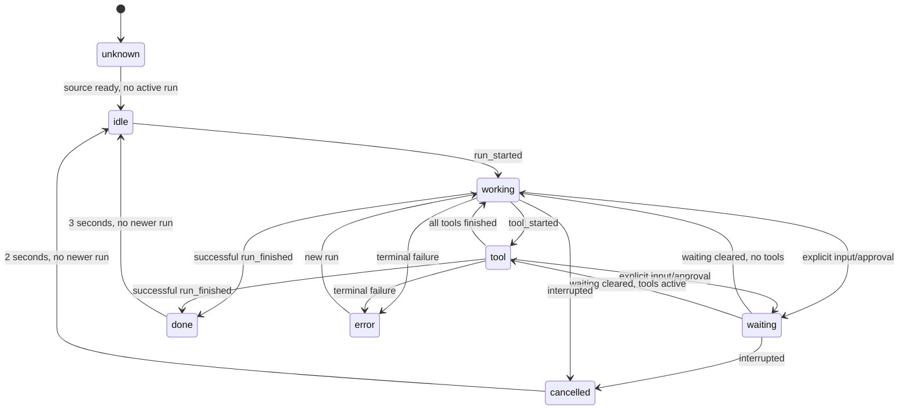

# 03 · 状态归约、会话、选择与时间

## 1. 四个正交维度

```text
business_state : idle | working | tool | waiting | done | error | cancelled | unknown
source_health  : ready | partial | unavailable | needs_auth | disabled
link_state     : handshaking | online | offline
ui_route       : FACE | AGENT_PICKER | STATS
```

`stats`、`switching` 不属于业务状态。设备断开时保留最后业务快照但画离线态，不在Bridge账本中伪造一次Agent错误。

状态证据质量：`observed`（生命周期/结构化事实）、`inferred`（不完整结构推断）、`reported`（Agent通过MCP自报）、`manual`、`simulated`。`unknown`不是错误，`cancelled`不是失败。

## 2. CanonicalEvent（仅在 Mac 内部）

Schema：`contracts/agent-event.schema.json`。关键字段：

```text
agent_id, source_instance, event_id, session_key, run_id,
kind, occurred_at_ms, received_at_ms, source_seq, quality,
tool_call_id, usage_record, reason, detail
```

- `session_key` 是本地哈希，不发绝对工作区路径。
- run是一次用户轮次/任务生命周期，不是每次LLM API调用。
- tool_call_id用于集合增删；并发工具返回一个不代表其他工具已结束。
- 事件来源的原始格式不进入设备协议。取白名单后立即丢弃Prompt/工具参数。
- event_id使用上游稳定ID；缺失时由源实例、session、run、kind、工具ID、源内序号构成稳定摘要。不能用每次重试新UUID导致重复计数。

## 3. 单run归约规则

| 事件kind | 处理 |
|---|---|
| session_opened | 建会话，尚无活跃run则idle；不增加任务数 |
| run_started | 创建run，turn计数一次；清空新run自己的工具集合；working |
| tool_started | 向集合加入tool_call_id；非waiting时tool |
| tool_finished | 移除匹配tool；仍有工具则tool，否则working |
| tool_failed | 记录工具失败并移除；仅终止性run失败才进入error |
| waiting_started | 保存waiting_reason=input/approval；waiting |
| waiting_cleared | 恢复tool或working；没有开始事实则unknown |
| run_finished | 同run终结：done（completed）/cancelled/error |
| session_closed | 若有活跃run但无结局，不假称done，标unknown/stale |
| usage_recorded | 只更新账本，不因计费信息改变表情 |
| source_status | 更新source_health，不直接创造run |

等待若只来自“工具开始”不能认定；必须有明确权限/输入等待事件。模型API失败但自动重试中也不能提前宣告整个run失败。

`done`表情保持3秒后呈现idle，`cancelled`保持2秒。终结事实保留在Mac；设备只停止庆祝动画。新run/新waiting立即覆盖旧done，旧run迟到的stop不得覆盖新run。

## 4. 多会话与代表会话

v1显示一个产品的代表会话，但Bridge管理每产品最多16个活动会话、总64个；超过上限不任意逐出正在waiting的会话，拒绝新增并给出capacity告警。

选择规则：

1. 若Mac配置固定session，且该session可观察，固定它。
2. 否则优先waiting会话（最早未解决者优先）。
3. 否则保留当前仍在working/tool的代表会话，防止频繁跳脸。
4. 当前无活动时，选最近开始的working/tool。
5. 再选最近3秒内done或持续未确认error。
6. 最后显示idle；没有可靠观测则unknown。

`active_sessions`显示该产品工作/工具/等待的会话数。切换产品不清空任何会话。来自其他产品的提醒只加badge/toast。

产品色与状态色正交；一个产品背后可用不同模型/provider。Hermes通过Codex后端执行时，用 `origin_agent_id=hermes` 归属该任务，底层Codex仅作 provider；没有可关联ID时不能跨源合并，显示可能重复的覆盖说明，不制造全局总数。

## 5. 连接、新鲜度与恢复

- USB保活：Bridge每2秒发ping；设备回pong。6秒没有合法消息视为link offline；30秒关屏。
- 源的状态新鲜度与USB独立。Bridge在线但某Agent无法观察时，health=partial/unavailable。
- Hooks是事件流，可能长时间安静。无业务事件300秒时标 `stale=true`，但不自动判为完成/离线；若有可靠run查询或进程/会话存活证据，可更新该源的观测时间。
- 查到进程存在只能证明进程存在，不能证明在工作。
- Bridge重启：历史usage可恢复，活跃run先标unknown并重新获取证据；不得将落盘working直接当现在还在工作。
- 时间差/TTL/手势用单调时钟；日统计和reset时间用UTC毫秒 + IANA时区。Mac睡眠唤醒后作一次显式resync，不能补播过期done动画。

## 6. 并发、乱序、重复

对同source_instance/session/run维护 `source_seq`（若上游有）。重复event_id忽略；未知seq的迟到事件只能在所属run范围内补事实，不能回滚已终结run或当前新run。

工具集合上限32/run；超限标partial并截断UI明细，不影响Agent任务。事件队列满时不丢账本终结事实：Hook落私有有界spool，Bridge优先处理终结/等待事件；容量耗尽后显式记录lost_events，统计coverage=partial。

UI快照可合并为最新值；控制ack与通知不允许被普通heartbeat淹没。总线只保证当前显示最终一致，不承诺展现每个持续10ms的工具步骤。

## 7. 选择事务

Host保存 `selected_agent` 和递增 `selection_rev`。设备有独立 `preview_agent`。请求携带 `action_id`、目标agent、`base_selection_rev`。

- accepted：Bridge先持久化选择（SQLite事务），rev+1，返回ack，再发新focus与stats。
- conflict：base_rev旧，返回rejected和当前selected/rev，设备恢复权威值。
- replay：同link/action_id返回相同ack，不二次递增rev。
- timeout：4秒未完成则取消pending；不要把本地预览当已成功。
- 断线期间不缓存选择请求用于自动重放，避免连上另一台Mac后意外切换。

设备重新连接接收Host选择；未握手前最多显示上次缓存，带offline。选择偏好只在Host持久化，不频繁写板上NVS。

## 8. 状态机图



完整边界见 `acceptance/state_cases.json` 和验收文档。状态图是视图，不代替run_id约束。

## 9. 状态源字段补充

CanonicalEvent 的 `source_health` 只在 `kind=source_status` 时非null，取ready/partial/unavailable/needs_auth/disabled。其他事件必须null，防止一次usage事件误改连接。空source/run/tool标识不能当作合法ID。Host将health投影到catalog，设备不自行猜测进程状态。
