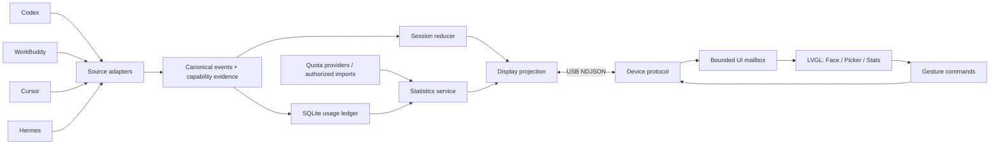

# 04 · 总体架构与模块边界

## 1. 选定路线

**ESP-IDF v6.1 + C + Waveshare BSP + LVGL 9；Mac Python Bridge；USB优先。**

不选 ESP32 直连四家云API：账号/产品差异不应进入固件。也不选视频推屏：网络波动不该让眨眼停顿。初版不写SwiftUI/Tauri壳：本地CLI、诊断和launchd足够，后续可复用Bridge服务。

## 2. 流向



## 3. 固件边界

| 模块 | 只做什么 | 不做什么 |
|---|---|---|
| board_port | BSP包装、触摸坐标、电源/亮度 | 不自改PMIC引脚和rail |
| protocol | 帧拆分、版本/范围/seq校验 | 不更新LVGL，不解释产品原始Hook |
| device_store | catalog/focus/stats缓存、选择revision | 不计算真实计费 |
| face | 参数化眼睛、眨眼、状态过渡 | 不读取网络或Flash账号 |
| navigation | 三屏路由、modal返回、手势仲裁 | 不执行任务 |
| stats_view | 显示与格式化 | 不根据计时猜剩余额度 |
| power | 亮度、dim、display off | v1不让MCU deep sleep |

## 4. Bridge边界

`adapter`输出CanonicalEvent或CapabilityReport；`reducer`独立纯逻辑；`ledger`幂等计数；`quota_provider`定时/手动刷新；`projection`生成设备所需短信息；`transport`只管串口；`commands`只允许选择/刷新/已配置应用打开。

Source Adapter不能直接设置脸型，UI也不能知道腾讯/Nous的日志结构。厂商变化应局限在 `bridge/src/bot_bridge/adapters/`。

## 5. 并发模型

Mac asyncio一条主loop，serial读写置独立worker或非阻塞封装；SQLite写入串行worker，不在串口接收回调执行长事务。Hook先做白名单清洗，写本地有界spool或快速HTTP，超时不得挂住原Agent。

ESP32沿用BSP的LVGL调度/显示锁；RX/TX两个轻任务，渲染只有一个逻辑owner。UI每33ms检查最新mailbox（目标30fps）；不复制整个动态对象树。Stats页不可见时只更新缓存，不每条usage都绘图。

## 6. 建议源码布局（实施时创建）

```text
firmware/
  CMakeLists.txt
  sdkconfig.defaults
  partitions.csv
  main/app_main.c
  main/idf_component.yml
  components/board_port/{board_port.c,include/board_port.h}
  components/bot_core/{frame_parser.c,decode.c,device_model.c,gesture.c,router.c,format.c,power_policy.c}
  components/bot_core/include/{bot_types.h,bot_gesture.h,bot_frame_parser.h,bot_model.h}
  components/bot_ui/{face.c,face_anim.c,picker.c,stats.c,notice.c,ui.c,include/bot_ui.h}
  components/bot_transport/{usb_serial.c,include/bot_transport.h}
bridge/
  pyproject.toml
  src/bot_bridge/{cli.py,config.py,service.py,capabilities.py,models.py}
  src/bot_bridge/{reducer.py,ledger.py,storage.py,selection.py,actions.py}
  src/bot_bridge/{usage.py,quota.py,imports.py,protocol.py,serial_link.py,publisher.py}
  src/bot_bridge/{server.py,auth.py,spool.py,hook_emitter.py,simulate.py}
  src/bot_bridge/adapters/{base.py,codex.py,cursor.py,workbuddy.py,hermes.py}
  src/bot_bridge/installers/{codex_hooks.py,cursor_hooks.py,launchd.py}
  migrations/001.sql
  tests/
integrations/{hermes_bot_status,workbuddy_status_mcp}/
tests/native/          纯C逻辑测试，不链接板上驱动
simulator/             原生LVGL SDL测试入口，不是Web仿真替代品
evidence/              本地真实检测、硬件测试与发布报告
```

相邻文件共同变化时可以合并；不要把一个20行文件强行拆五层框架。纯逻辑头文件不要依赖ESP-IDF/LVGL，以便Mac原生C测试。

## 7. 版本和依赖

EIM用户已安装的v6.1是目标；不重新装“默认最新版”。官方当前示例指南列出的验证线是v5.5.5/v6.0.2，因此T02必须先执行v6.1兼容性验收。[S02][S04]

当前示例 `02_lvgl_demo_v9/main/idf_component.yml` 指向LVGL `9.4.*` 与标准1.75 BSP通配版本。以本地首次成功解析为准，提交lock并将通配符改为已验证版本，不手写猜测版本号。[S03]

## 8. 关键设计决策

| 决策 | 理由 | 放弃的替代 |
|---|---|---|
| 三个逻辑页面 | 控制圆屏认知负担 | 五层设置/任务列表 |
| Host权威选择 | 多来源/断连一致 | 设备先乐观切换永不回滚 |
| 分离统计与focus | 避免每2秒重传所有账本 | 巨大全局JSON快照 |
| 双向USB先行 | 已连接供电，无配网依赖 | 首天引入BLE与公司网络 |
| 按字段质量和覆盖 | 不误导用户 | 一句“数据大致准确” |
| 公开API/本地证据优先 | 可维护与隐私 | 拷贝Cookie调用私有端点 |
| 短标签英文UI | 固件字体资源受控 | 动态渲染任意聊天文本 |
