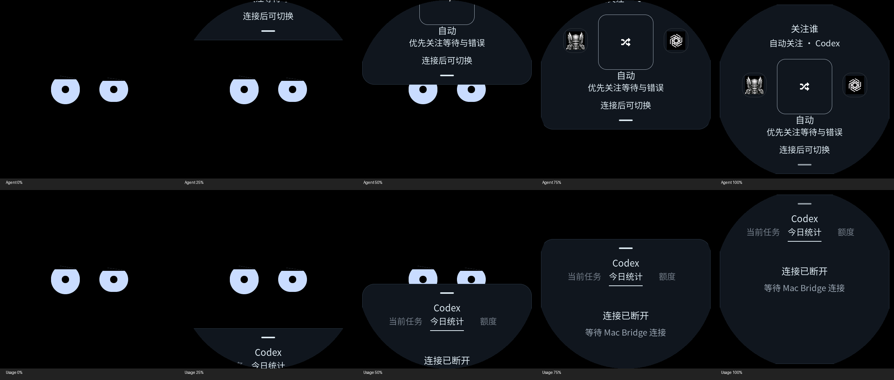

# OS 边缘卡片交付记录 — 2026-09-07

## 交付状态

导航和渲染改造已实现；冻结 USB v2 源码的固件构建通过。**本轮未刷写设备，实机手感验收尚未完成。** 工作区在执行过程中并行迁移 USB v3（`bot_frame.c`、`bot_model.c`、`bot_link.c` 等发生变化）；最终常规构建在该解析器的 misleading-indentation 警告处失败。未覆盖或回退并行修改；隔离构建使用本轮开始时的 v2 core/link 快照，加本轮导航/UI 实现及已有诊断接口。共享源码中的导航状态机和卡片容器改动保留，冻结产物单独供复核。归档完成后并行任务继续修改了 `ui.c` 与 `stats.c`（嵌套用量导航和 v3 dashboard），因此这里的构建、旧用量标签动效与回放结论只覆盖归档版本，不代表当前混合 v3 工作树已通过验收。合并后的导航契约与用量页仍需一起复核。

- [设计规范](../../docs/os-motion-design.md) / [触摸契约](../../docs/touch-interactions.md)
- [冻结源码](source-v2.tar.gz) / [源码哈希](source-manifest.json)
- [固件](bot-status-os-v2.2.0.bin)：865,952 bytes，应用偏移 0x10000，8 MiB 应用分区剩余约 90%。
- SHA-256：`40e400c8464efc2f827f7edd20ffa6aa9dee5cfda6b69710b13396ae02ca23c1`。
- [固件清单](firmware.json) / [完整构建日志](firmware-build.log)。只包含本次 v2 导航交付，不包含并行 v3 用量协议。

构建命令：激活 `tools/idf-env.sh` 后运行 `idf.py -C /tmp/robot-os-release/firmware -B /tmp/robot-os-release/build build`。归档不包含 build/managed_components；依赖版本保留在归档 lock/manifest 中，使用既有 ESP-IDF v6.1、BSP 3.0.1、LVGL 9.4。

## 实际实现的 UI 回放

`tools/replay_os_ui.c` 直接调用生产 `bot_ui_touch_frame`、`bot_ui_poll` 和 LVGL timer/render，使用相同的导航状态机、容器、Face、卡片和动画对象。输入是合成坐标脚本，并非实机录制；没有替代动画引擎、直接设置进度或假冒硬件双点。账号数据缺失时使用生产缺失提示。

构建：`cmake --build /tmp/robot-face-lvgl --target replay_os_ui`。运行：

```sh
/tmp/robot-face-lvgl/replay_os_ui reports/os-motion/replay \
  < reports/os-motion/replay/spatial.touch > reports/os-motion/replay/spatial.csv
```

每行 `time_ms count x0 y0 x1 y1 cancel`，后面坐标/取消项可省略；`rotation 90` 可注入运动朝向。输出 PPM 及 CSV（phase、card、progress、y、velocity、stable_open、渲染 CPU 耗时、顶层对象数）。`BOT_REPLAY_NO_IMAGES=1` 可只导出 CSV。



[空间脚本](replay/spatial.touch) / [位移记录](replay/spatial.csv)：Agent 和用量 p≈0/.25/.5/.75/1 来自对应方向，停靠 y=12。Face 层未重建；在露出区域持续存在。圆屏外像素在导出时裁掉，停靠文字和把手可见。25%/75% 因整数触点精度为 25.11%/75.11%。

[场景结果](replay/scenario-results.json) 和同目录同名 `.touch` / `.csv`：

| 合成场景 | 观察结果 |
|---|---|
| short_cancel、hold、diagonal、body_to_edge | 保持/回到 Face，无误打开 |
| flick | 68 px 有效快甩完成打开 |
| paused_release | 相同短行程停留后取消，未沿用过期速度 |
| reverse_flick | 距离已超过阈值，反向速度仍优先取消 |
| reversal_distance | 拉开后慢慢拉回，按最后距离取消 |
| multi_cancel、input_cancel | 回到 Face，余下单指没有补发导航 |
| regrab_cancel | 中断未完成的吸附；再次取消返回上次稳定 Face |
| panel_body | 面板正文纵滑保持停靠，不返回 |
| endpoint_damping | Agent y 从 12 阻尼到 17.94，释放归 12 |
| rotated_top | 90° 运动输入下，物理顶部仍拉入 Agent |
| spatial | 四个边缘操作均完成对应的打开/收起 |

[30 次开合](replay/cycles.csv) 最终回到 Face，首次创建后顶层对象数一直为 2（Face 和 Agent）。所采样输入后的主机软件渲染 CPU 耗时平均 0.207 ms、最大 0.941 ms，见 [性能记录](replay/performance.json)。**不是设备帧提交、面板刷新率或完整 heap 泄漏测量**；回放不证明实机无闪屏/残影。

## 已有检查

未新增单元测试，也未修改旧断言。新增的 replay executable 不注册为 CTest。

[LVGL 日志](lvgl-checks.log)：6/14 通过——production、quota_unknown、quota_full、terminal_resume、motion_rotation、motion_reaction。

8 项保留失败：smoke（长按入口）、stats_tab（纵滑切标签）、picker_target/cycling（确认后即时切页）、terminal_hidden（右滑返回）、motion_input_navigation/stale（右滑返回及旧方向路由）、motion_input_contact（假定边缘导航锁住 Face 旋转矩阵）。这些断言使用已退休的导航/时序契约，不能据此报告全套通过。

本轮发现的新问题：常驻 Face 在 SIM→生产展示的测试切换中留下 SIM 标记，已修复；production 重新通过。导航同时补上释放坐标锁定和回退时间戳保护。本次所改文件的空白检查通过；全工作区空白检查被并行 v3 解析器中的尾随空格阻断，未修改该部分。

[Native 日志](native-checks.log)：2/6 通过（types、device_model）；gesture/coalesced/router 失败对应旧 HOLD/路由契约，frame_parser 的历史 v1 示例与现有 v2 解析器不匹配，属于原有基线失败。本轮没有修改冻结 v2 解析器业务逻辑。

## 尚未完成的实机验收

本轮设备基线读取为 firmware 2.1.0 / protocol 2，随后未刷写，不把旧固件诊断当作 OS 新固件性能。并行工作正在修改协议及主机链路，需在设备刷写归属明确后进行以下项目：

- 四个边缘操作、慢拖/快甩/反向/停住释放/吸附接管/连续开合的实体手感。
- 第二指加入回弹、交叉/单指先离开/短暂丢点、旋转后边缘、首触唤醒及松手不误点。
- Agent 主机确认/拒绝/主动关闭后的迟到确认，面板内状态更新、用量标签与返回 Face 的时钟连续性。已有 model/production 检查不是完整的实体 ACK 手势验收。
- 实际帧提交耗时、持续拖动、黑帧/闪屏/残影和长时间 heap 增长。

上述项目仍为交付前置验收项；未用单点模拟或主机渲染替代双指实机能力证明。
